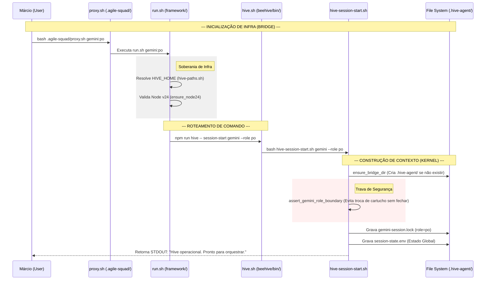
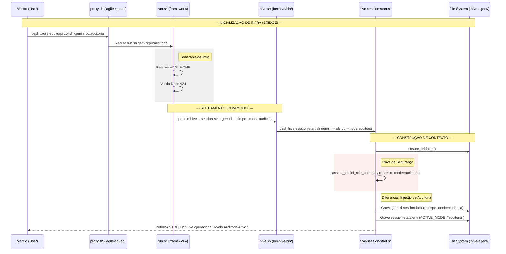
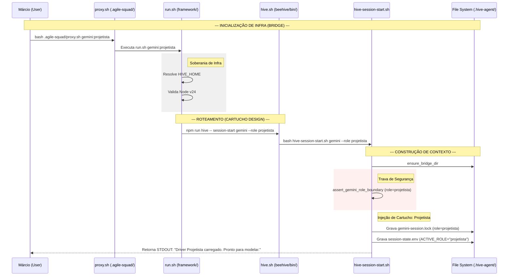
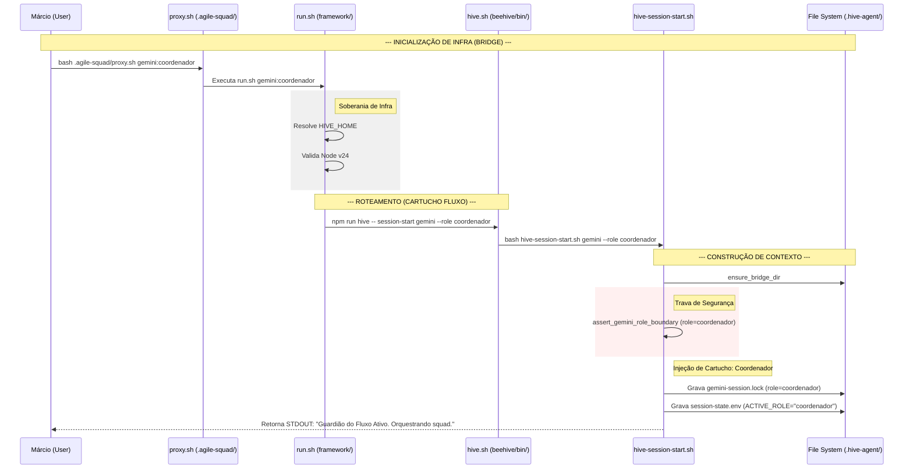
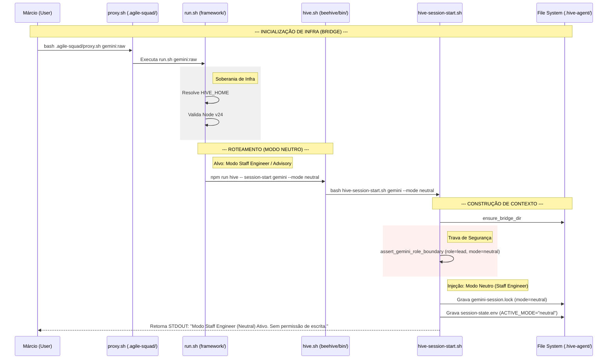

# Arquivo Consolidado: Fluxos de Agentes Hive (Exportação para tldraw/Mermaid)

Este documento contém todos os diagramas Mermaid gerados para o mapeamento profundo dos fluxos de inicialização dos agentes. Você pode copiar os blocos de código `mermaid` e colar diretamente no **tldraw** (se ele suportar integração nativa com Mermaid) ou usar o [Mermaid Live Editor](https://mermaid.live/) para gerar imagens/SVGs para colar no seu canvas do tldraw.

---

## 1. Fluxo: `gemini:po`

---

## 2. Fluxo: `gemini:po:auditoria`

---

## 3. Fluxo: `gemini:projetista`

---

## 4. Fluxo: `gemini:coordenador`

---

## 5. Fluxo: `gemini:raw`

