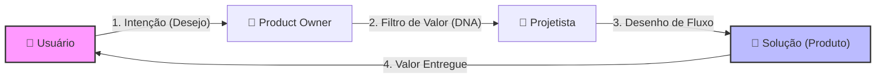

# Modelo: DRIVER de Cognição (HIVE Standard)

> **Nome do Arquivo:** `DRIVER.md`
> **Aplicação:** Todo diretório dentro de `ai/cognition/` deve conter este arquivo.

---

# [Nome do Módulo/Processo]

## 🎯 Objetivo
[Descrição curta do propósito desta habilidade/processo.]

## 📜 Regras e Contratos
- [Regra 1]
- [Regra 2]
- [PROIBIÇÃO: O que não fazer]

## ⚡ Gatilhos (Triggers)
- [Comando CLI]
- [Estado do Sistema]

## 🔗 Conexões
- [Link para outro Processo]
- [Link para o Manifesto]

---

# 🎨 Modelo de Interação: Visão de Negócio & Usuário

Este modelo deve ser usado para documentar o "Porquê" e o "Como o Usuário interage" com a solução.

## 👥 Persona e Dor
- **Quem é o usuário?** [Descrição]
- **Qual o problema?** [A dor que estamos curando]

## 🔄 Diagrama de Interação (User Journey)

## 💎 Proposta de Valor
1. [Ganho 1: Ex: Redução de tempo em 50%]
2. [Ganho 2: Ex: Eliminação de erro humano]

---
*Este padrão garante a simbiose entre a Regra Técnica (Driver) e a Intenção de Negócio (Interação).*
