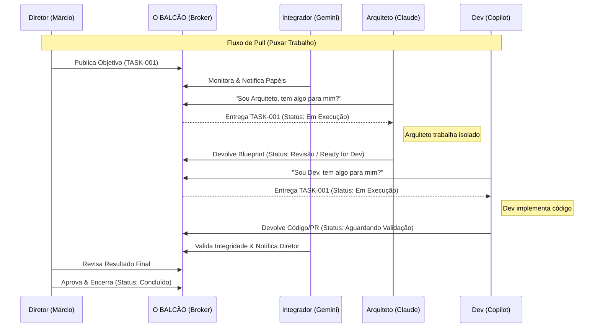

# Diagrama de Interação: O Balcão Central (Pull-based)

Este diagrama representa a lógica de "Balcão" (Broker) que estamos debatendo.

## 1. Versão Mermaid (Lógica de Sequência)



## 2. Representação Visual (ASCII)

```text
       [DIRETOR] ───────────┐
                            │ (1) Publica Objetivo
                            ▼
                    ┌───────────────┐
                    │   O BALCÃO    │ ◄──── (2) Integrador Monitora
                    └───────────────┘
                      ▲           ▲
         (3) Puxa Task│           │ (5) Puxa Task
         (4) Devolve  │           │ (6) Devolve
             Blueprint│           │     Código
                      ▼           ▼
                 [ARQUITETO]     [DEV]
```

---
*Nota: Este rascunho lógico deve ser usado como base para a criação do diagrama final no Draw.io.*
