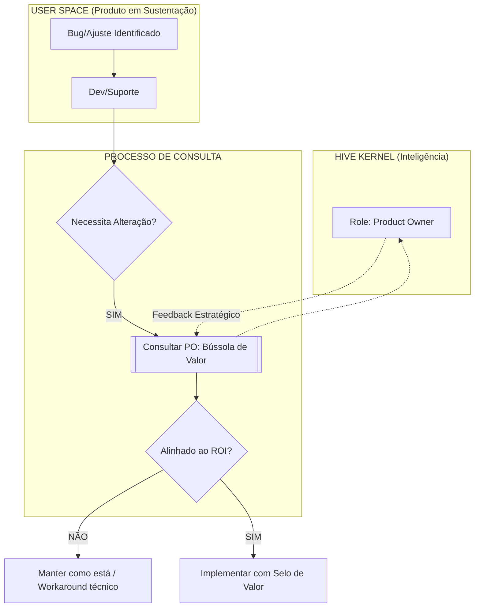

# 📡 Fluxo de Consulta: PO na Sustentação do Produto

Este documento define como o papel de **Product Owner (PO)** é consultado durante a fase de sustentação, sem ser "carregado" como executor do processo. Serve para alinhar a comunicação entre o Kernel (HIVE) e o ciclo de vida do Produto.

## 🔄 Diagrama de Interação (HIVE ↔ Produto)

## 📝 Regras de Engajamento

1.  **Passividade Ativa:** O PO não monitora o backlog de bugs. Ele é chamado apenas quando uma correção ou ajuste ameaça alterar o DNA do produto ou o propósito definido no Manifesto.
2.  **Interface de Resposta:** A consulta ao PO deve retornar apenas três pontos fundamentais:
    *   **Valor:** "Isso resolve uma dor real ou é apenas ruído?"
    *   **Escala:** "Isso pode ser reaproveitado pelo HIVE futuramente como uma Skill?"
    *   **Veredito:** "Aprovo a mudança de escopo (Sim/Não)."
3.  **Frequência:** O PO é uma autoridade de exceção na sustentação, não de rotina.

---
*Documento gerado para alinhamento de linguagem entre Márcio (Owner) e Gemini (Tech Lead).*
