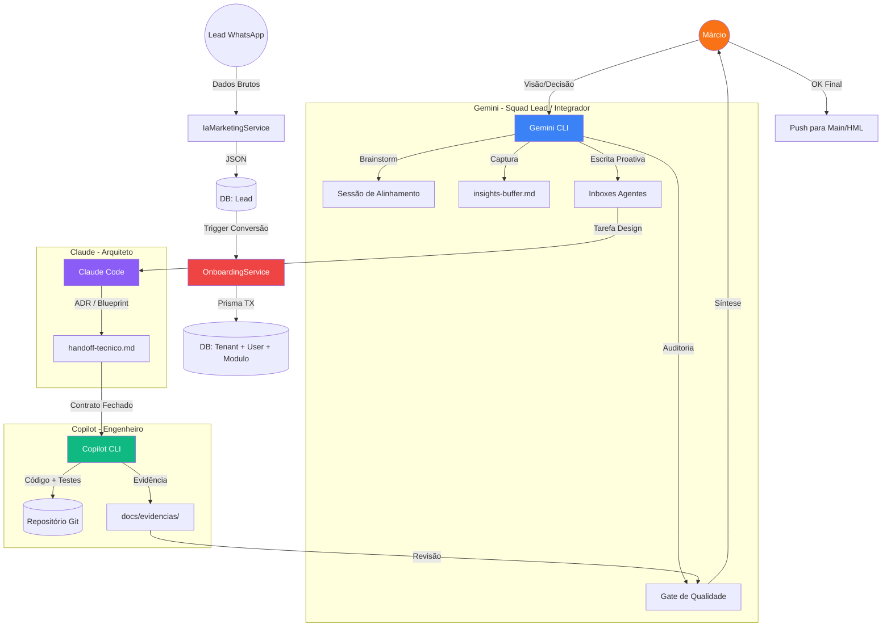
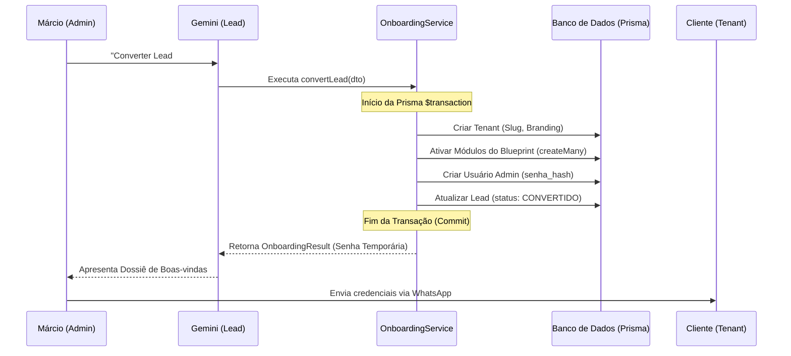

# Arquitetura de Fluxo & Visão Técnica: Squad Framework V2

Este documento detalha a infraestrutura lógica e operacional da nossa "Fábrica de Software", unindo a visão de processos aos mecanismos técnicos de execução.

---

## 1. Topologia de Orquestração (High Performance)

---

## 2. Visão Técnica: O Processo Atômico de Onboarding (#97)

O Onboarding não é apenas um formulário, mas uma **Transação de Estado Atômica**. O diagrama abaixo descreve a sequência técnica exata implementada para garantir que nenhum tenant nasça "capenga".

---

## 3. Visão Técnica: Mecanismos de Governança

A robustez do Squad V2 baseia-se em três pilares técnicos:

### A. Configuração como Código (YAML)
Em vez de instruções em texto livre, o papel de cada agente é regido pelo `ROLES_CONFIG.yaml`.
*   **Vantagem:** Permite que o CLI valide permissões antes da execução.
*   **Parsing:** O Gemini Lead lê o YAML para decidir quais tarefas pode delegar ou assumir.

### B. Sincronização e Lock (Flock)
Como operamos com múltiplos terminais simultâneos, a escrita nos Inboxes e no Board usa um sistema de **Lock por Arquivo (`flock`)**.
*   **Mecanismo:** `scripts/local/squad-inbox-write.sh` garante que duas IAs não escrevam no mesmo `.md` ao mesmo tempo, evitando perda de tarefas (TOCTOU).

### C. Semáforo de Execução (DIR-047)
O feedback loop entre o usuário e os agentes é regido por estados visíveis:
*   🟢 **[PODE EXECUTAR]**: A IA tem permissão total.
*   🟡 **[AGUARDA MÁRCIO]**: Checkpoint de segurança ou dúvida.
*   🔴 **[BLOQUEADO]**: Falha de auditoria ou correção pendente.

---

## 4. Fluxo de Transformação de Dados

O valor do TenantOS reside na **Inteligência Comercial** integrada:

| Origem (Lead JSON) | Motor de Inferência | Destino (Schema Core) |
| :--- | :--- | :--- |
| `nicho: 'Salão'` | Blueprint Mapper | `TenantModulo`: Agenda, Clientes |
| `logo: 'base64...'` | Design Assistant | `Branding.logo_url` |
| `cor: '#FF5733'` | Color Extractor | `Branding.cor_primaria` |
| `email: 'joao@...'` | User Factory | `Usuario.email` (admin) |

---
*Documento de referência técnica — Squad V2 "High Performance".*
