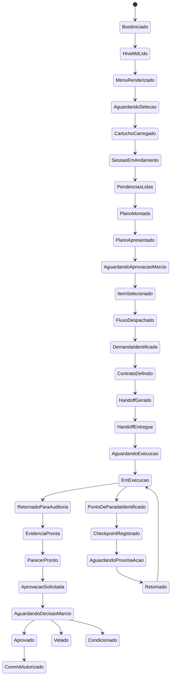

# Estados das Interações Sistêmicas do Hive

> **Objetivo:** formalizar os estados mínimos das interações críticas do Hive, criando uma base de referência para teste sistêmico, padronização de saída e futura implementação da regra de “próximo passo explícito”.

---

## 1. Por que este documento existe

O levantamento consolidado mostrou que o Hive:
- já possui boa documentação de fluxo e sequência;
- não possui ainda **diagramas de estado formais**;
- mistura comportamento esperado, fluxo real e artefatos vivos sem uma máquina de estados explícita.

Este documento fecha essa lacuna.

---

## 2. Estados críticos por interação

### 2.1 Boot / Menu Inicial do Gemini

**Estados:**
1. `boot-iniciado`
2. `hive-md-lido`
3. `menu-renderizado`
4. `aguardando-selecao`
5. `cartucho-carregado`
6. `sessao-em-andamento`

**Transições válidas:**
- `boot-iniciado` → `hive-md-lido`
- `hive-md-lido` → `menu-renderizado`
- `menu-renderizado` → `aguardando-selecao`
- `aguardando-selecao` → `cartucho-carregado`
- `cartucho-carregado` → `sessao-em-andamento`

**Risco principal se quebrar:**
- menu sem ação clara;
- boot resumido demais;
- carregamento direto de cartucho sem deixar claro o que o Márcio precisa fazer.

---

### 2.2 Plano de Voo / Coordenação

**Estados:**
1. `pendencias-lidas`
2. `plano-montado`
3. `plano-apresentado`
4. `aguardando-aprovacao-marcio`
5. `item-selecionado`
6. `fluxo-despachado`

**Transições válidas:**
- `pendencias-lidas` → `plano-montado`
- `plano-montado` → `plano-apresentado`
- `plano-apresentado` → `aguardando-aprovacao-marcio`
- `aguardando-aprovacao-marcio` → `item-selecionado`
- `item-selecionado` → `fluxo-despachado`

**Risco principal se quebrar:**
- Coordenador agir sem aprovação;
- Plano de Voo terminar sem instrução do que responder;
- salto direto para execução.

---

### 2.3 Handoff / Work Order

**Estados:**
1. `demanda-identificada`
2. `contrato-definido`
3. `handoff-gerado`
4. `handoff-entregue`
5. `aguardando-execucao`
6. `em-execucao`
7. `retornado-para-auditoria`

**Transições válidas:**
- `demanda-identificada` → `contrato-definido`
- `contrato-definido` → `handoff-gerado`
- `handoff-gerado` → `handoff-entregue`
- `handoff-entregue` → `aguardando-execucao`
- `aguardando-execucao` → `em-execucao`
- `em-execucao` → `retornado-para-auditoria`

**Risco principal se quebrar:**
- handoff parecer emitido por agente errado;
- ausência de próximo responsável;
- execução iniciada sem contrato fechado.

---

### 2.4 Checkpoint

**Estados:**
1. `trabalho-em-andamento`
2. `ponto-de-parada-identificado`
3. `checkpoint-registrado`
4. `aguardando-proxima-acao`
5. `retomado`

**Transições válidas:**
- `trabalho-em-andamento` → `ponto-de-parada-identificado`
- `ponto-de-parada-identificado` → `checkpoint-registrado`
- `checkpoint-registrado` → `aguardando-proxima-acao`
- `aguardando-proxima-acao` → `retomado`

**Risco principal se quebrar:**
- checkpoint parecer conclusão;
- faltar clareza sobre quem age em seguida;
- perda de retomada.

---

### 2.5 Status

**Estados:**
1. `estado-lido`
2. `status-resumido`
3. `proximo-passo-identificado`
4. `acao-esperada-explicita`

**Transições válidas:**
- `estado-lido` → `status-resumido`
- `status-resumido` → `proximo-passo-identificado`
- `proximo-passo-identificado` → `acao-esperada-explicita`

**Risco principal se quebrar:**
- status virar só descrição;
- ausência de ação esperada;
- perda do caráter operacional.

---

### 2.6 Pedido de Aprovação / The Gate

**Estados:**
1. `evidencia-pronta`
2. `parecer-pronto`
3. `aprovacao-solicitada`
4. `aguardando-decisao-marcio`
5. `aprovado`
6. `vetado`
7. `condicionado`
8. `commit-autorizado`

**Transições válidas:**
- `evidencia-pronta` → `parecer-pronto`
- `parecer-pronto` → `aprovacao-solicitada`
- `aprovacao-solicitada` → `aguardando-decisao-marcio`
- `aguardando-decisao-marcio` → `aprovado`
- `aguardando-decisao-marcio` → `vetado`
- `aguardando-decisao-marcio` → `condicionado`
- `aprovado` → `commit-autorizado`

**Risco principal se quebrar:**
- gate sem decisão explícita;
- commit antes da afirmação;
- aprovação sem evidência observável.

---

## 3. Diagrama de estado consolidado

---

## 4. Uso deste documento no DEBATE-023

Este documento existe para:
1. dar formalidade de estados às interações sistêmicas;
2. reduzir ambiguidade entre “fluxo” e “estado”;
3. servir de referência para a futura implementação do padrão de saída;
4. apoiar a matriz de teste sistêmico com uma máquina de estados mínima.

---

## 5. Relação com os outros artefatos

- `beehive/construcao/MATRIZ_INTERACOES_SISTEMICAS_HIVE.md` → diz **quais** interações existem
- `beehive/construcao/MATRIZ_TESTE_SISTEMICO_INTERACOES_HIVE.md` → diz **como testar**
- `beehive/construcao/ESTADOS_INTERACOES_SISTEMICAS_HIVE.md` → diz **em que estados cada fluxo transita**

