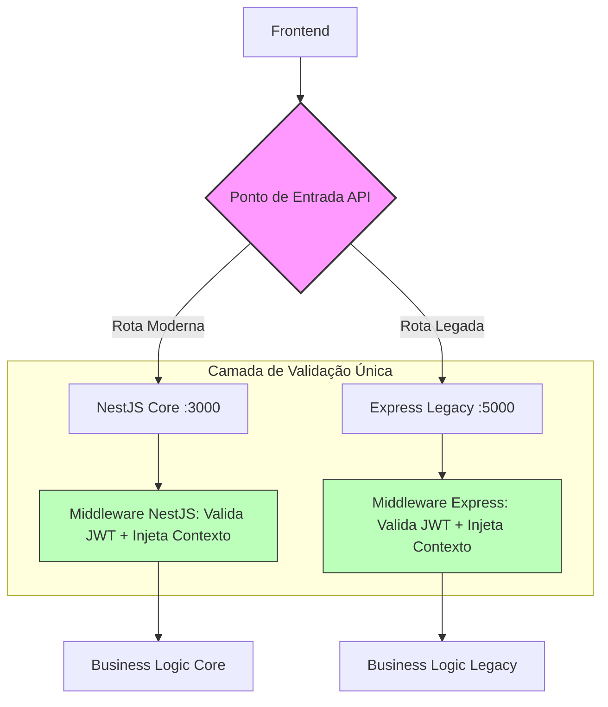

# Blueprint: Interoperabilidade de Core (Ponte NestJS <> Express)
**Vínculo:** INITIALIZATION_MAP.md
**Status:** Em Desenho (Projetista)
**Versão:** 1.0.0

---

## 1. 🎯 Objetivo Técnico
Resolver a "Bifurcação de Cérebros" unificando a identidade do usuário e o contexto do Tenant entre o novo Core (NestJS) e o Legado (Express). O objetivo é que o Frontend opere de forma transparente, sem precisar gerenciar logins diferentes para rotas diferentes.

## 2. 🔐 O Contrato de Identidade (Shared JWT)
Para que ambos os backends reconheçam o usuário, adotaremos um **JWT Único**:
- **Emissor (Issuer):** NestJS (Responsável único pela geração de tokens e renovação).
- **Validador (Validator):** Ambos. O Express deve possuir um Middleware que valida a assinatura do JWT usando a **mesma Secret Key** do NestJS.
- **Payload Padrão:**
```json
{
  "sub": "user_id_123",
  "email": "admin@petshop.com",
  "tenantId": "cuid_tenant_xyz",
  "role": "admin",
  "iat": 1716750000,
  "exp": 1716836400
}
```

## 3. 📡 O Contrato de Contexto (Tenant Propagation)
Para garantir que o `tenantId` seja detectado de forma idêntica:
1.  **Prioridade 1:** Payload do JWT (Campo `tenantId`).
2.  **Prioridade 2 (Fallback/Check):** Header HTTP `x-tenant-id`.
- **Regra de Ouro:** Se o `tenantId` do Header for diferente do `tenantId` do JWT, a transação deve ser bloqueada por conflito de segurança.

---

## 📐 Fluxo de Roteamento (A Visão de Voo)



---

## ⛓️ Handshake de Autenticação (A Visão de Engrenagem)

```mermaid
sequenceDiagram
    participant F as Frontend
    participant N as NestJS Core (Issuer)
    participant E as Express Legacy (Consumer)
    participant DB as Banco de Dados Prisma

    F->>N: POST /auth/login
    N->>DB: Valida Credenciais
    DB-->>N: Usuário OK + Tenant Context
    N-->>F: Retorna JWT (com tenantId no payload)

    Note over F, E: Acesso a Rota Legada
    F->>E: GET /api/v1/legacy-data
    Auth: Bearer <JWT>
    
    E->>E: Middleware: Valida Assinatura (Shared Secret)
    E->>E: Extrai tenantId do Payload
    E->>DB: Query: WHERE tenant_id = x
    DB-->>E: Dados Isolados
    E-->>F: JSON Response
```

---

## 🛠️ Especificação de Implementação (Work Order para Copilot)
1.  **NestJS:** Exportar a lógica de assinatura de JWT para um ambiente central (ou garantir que a Secret Key seja injetada via `env`).
2.  **Express:** Criar o arquivo `src/middlewares/auth-context.middleware.ts` que:
    - Lê o Bearer Token.
    - Decodifica usando `jsonwebtoken`.
    - Atribui o `tenantId` ao objeto `req.context`.
3.  **Segurança:** Garantir que o `tenant_id` detectado seja usado em todas as queries SQL/Prisma para evitar vazamento de dados.

---
## ⚖️ Critério de Aceite do PO
*"Eu consigo logar na nova tela de Onboarding e, no mesmo segundo, abrir a tela de Vendas (legada) sem ver erro de permissão ou dados de outro cliente?"*
