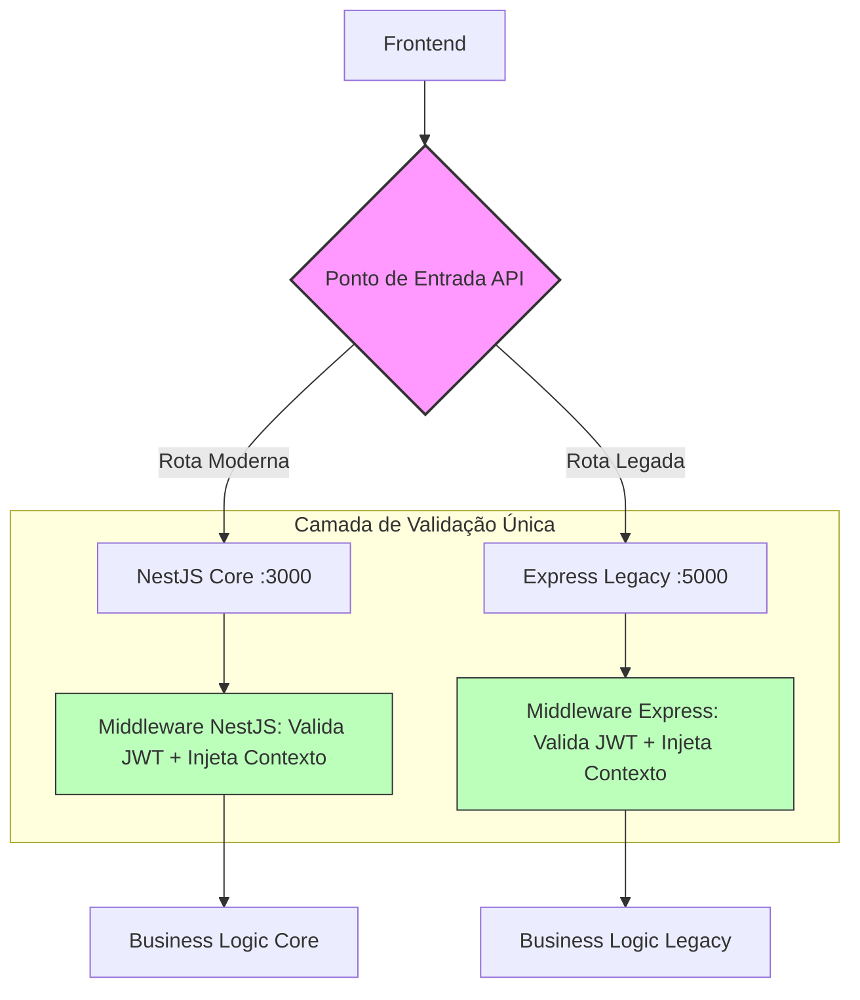

# Blueprint: Interoperabilidade de Core (Ponte NestJS <> Express)
**Vínculo:** DEBATE-011 (Consolidado)
**Status:** ✅ APROVADO (Aguardando OK Owner)
**Versão:** 1.1.0

---

## 1. 🎯 Objetivo Técnico
Unificar a identidade do usuário e o contexto do Tenant entre NestJS (:3000) e Express (:5000) via Shared JWT.

## 2. 🔐 O Contrato de Identidade (Shared JWT)
- **Emissor (Issuer):** NestJS.
- **Validador:** Middleware em ambos os backends.
- **Algoritmo:** Forçar `HS256`.
- **Segurança (MANDATÓRIO):** A Secret Key **NUNCA** deve ser hardcoded. Deve ser lida da ENV `JWT_SECRET`.

## 3. 📡 O Contrato de Contexto (Tenant Propagation)
- **Fonte de Verdade:** Payload do JWT (Campo `tenantId`).
- **Middleware Express:** Deve injetar `req.context.tenantId`.

---

## 📐 Fluxo de Roteamento (A Visão de Voo)



---

## ⛓️ Handshake de Autenticação (A Visão de Engrenagem)

```mermaid
sequenceDiagram
    participant F as Frontend
    participant N as NestJS Core (Issuer)
    participant E as Express Legacy (Consumer)
    participant DB as Banco de Dados Prisma

    F->>N: POST /auth/login
    N->>DB: Valida Credenciais
    DB-->>N: Usuário OK + Tenant Context
    N-->>F: Retorna JWT (com tenantId no payload)

    Note over F, E: Acesso a Rota Legada
    F->>E: GET /api/v1/legacy-data
    Auth: Bearer <JWT>
    
    E->>E: Middleware: Valida Assinatura (Shared Secret)
    E->>E: Extrai tenantId do Payload
    E->>DB: Query: WHERE tenant_id = x
    DB-->>E: Dados Isolados
    E-->>F: JSON Response
```

---

## 🛠️ Especificação de Implementação (Work Order para Copilot)
1.  **NestJS:** Exportar a lógica de assinatura de JWT para um ambiente central (ou garantir que a Secret Key seja injetada via `env`).
2.  **Express:** Criar o arquivo `src/middlewares/auth-context.middleware.ts` que:
    - Lê o Bearer Token.
    - Decodifica usando `jsonwebtoken`.
    - Atribui o `tenantId` ao objeto `req.context`.
3.  **Segurança:** Garantir que o `tenant_id` detectado seja usado em todas as queries SQL/Prisma para evitar vazamento de dados.

---
## ⚖️ Critério de Aceite do PO
*"Eu consigo logar na nova tela de Onboarding e, no mesmo segundo, abrir a tela de Vendas (legada) sem ver erro de permissão ou dados de outro cliente?"*
