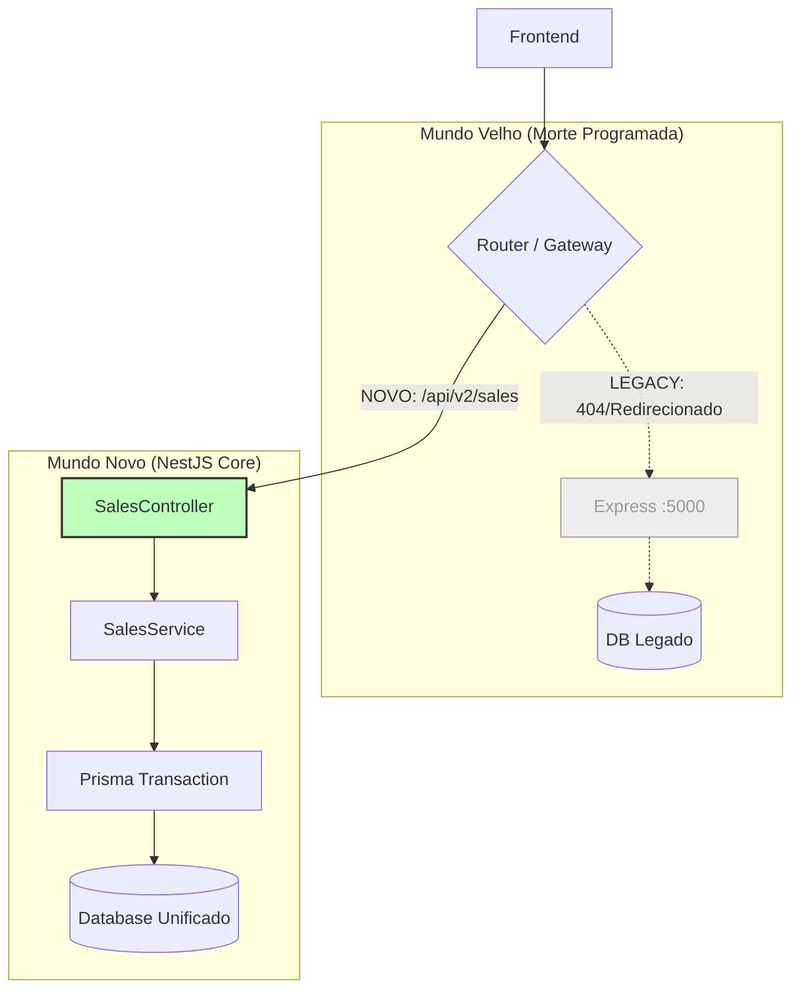
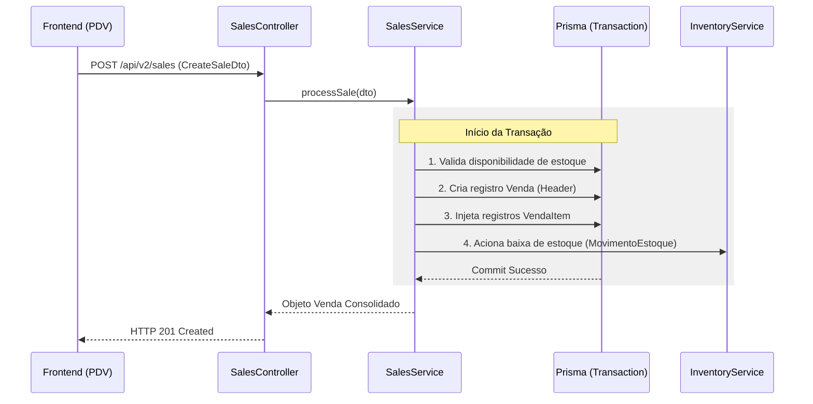

# Blueprint: Migração do Módulo de Vendas (Legacy Death)
**Vínculo:** DEBATE-012 (Nuclear Option)
**Status:** ✅ APROVADO PARA IMPLEMENTAÇÃO
**Versão:** 1.0.0

---

## 1. 🎯 Objetivo Técnico
Extinguir a lógica de processamento de vendas do backend Express (:5000) e reconstruí-la de forma robusta e tipada no NestJS Core (:3000). Esta é a primeira grande etapa da morte do legado.

## 2. 🏗️ Arquitetura no NestJS (Core)
O módulo de vendas será implementado sob o padrão **Domain-Driven Design (DDD)** simplificado dentro do Core.

### 2.1 Componentes:
- **`SalesModule`:** Encapsula controllers, services e providers.
- **`SalesController`:** Expõe os endpoints REST.
- **`SalesService`:** Contém a lógica de negócio (cálculo de totais, validação de estoque, atomicidade).
- **`SalesRepository`:** Interface Prisma para persistência.

### 2.2 Contrato de Dados (DTO):
```typescript
interface CreateSaleDto {
  clienteId?: string;       // Opcional
  itens: {
    produtoId: string;      // Pode ser 'produto' ou 'serviço'
    quantidade: number;
    precoUnitario: number;  // Snapshot do preço no momento da venda
    desconto?: number;
  }[];
  meioPagamento: 'DINHEIRO' | 'CREDITO' | 'DEBITO' | 'PIX' | 'MISTO';
  mesaNumero?: string;      // Extensão para Restaurante
  observacao?: string;
}
```

---

## 📐 Fluxo de Transição (A Visão de Voo)
*Foco: Como o sistema se comporta durante e após a migração.*



---

## ⛓️ Orquestração de Venda Atômica (A Visão de Engrenagem)
*Foco: Garantir que a venda e a baixa de estoque ocorram juntas.*



---

## 🛠️ Especificação de Implementação (Work Order)
1.  **Entidade Prisma:** Garantir que as tabelas `Venda`, `VendaItem` e `MovimentoEstoque` estejam sincronizadas com o novo schema.
2.  **Service Logic:** O `SalesService` deve calcular o `total` da venda no servidor para evitar manipulação maliciosa do frontend.
3.  **Cross-Module:** A integração com estoque (`InventoryService`) deve ser via injeção de dependência, mantendo o `SalesModule` limpo.

---
## ⚖️ Critério de Aceite do PO
*"O PDV continua funcionando exatamente como antes, mas agora eu vejo o log de custo diminuir e não tenho mais erros de 'Preço não definido' por falha de tipo?"*
