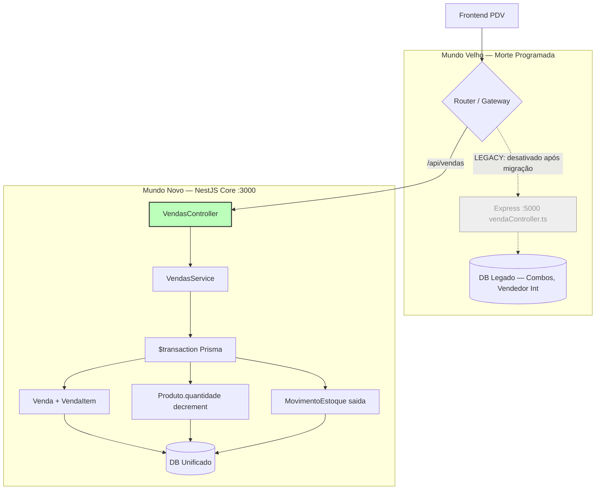
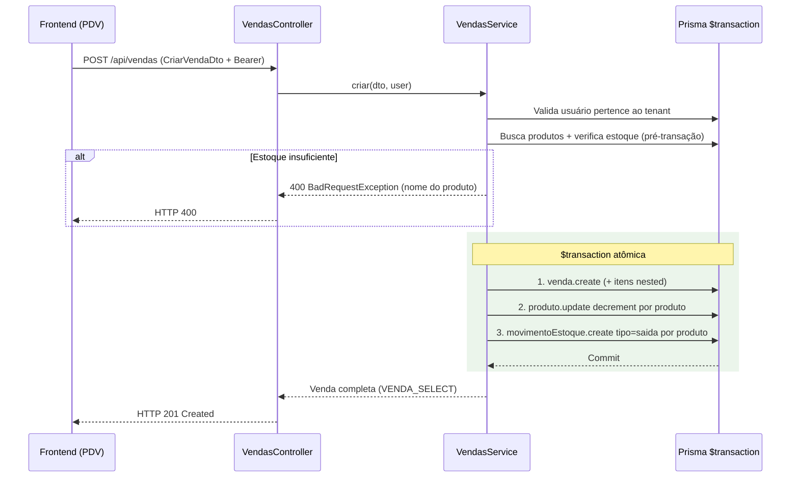

# Blueprint: Migração do Módulo de Vendas (Legacy Death — Módulo 2)
**Vínculo:** DEBATE-012 (Nuclear Option)
**Status:** ✅ CONTRATO FECHADO — pronto para implementação pelo Copilot
**Versão:** 2.0.0 — Auditoria completa por Claude (2026-05-26)

---

## 1. 🔍 Auditoria: Estado Real do Core

O Core (`tenantOS/backend/src/vendas/`) **já tem um `VendasModule` funcional**, mas com **4 gaps críticos** em relação ao legado. O blueprint v1.0 estava desatualizado — este documento substitui completamente.

### O que o Core já entrega (não implementar novamente)
| Funcionalidade | Status |
|---|---|
| Criar venda (estrutura base) | ✅ `VendasService.criar()` |
| Listar vendas | ✅ `VendasService.listar()` |
| Buscar por ID | ✅ `VendasService.buscarPorId()` |
| Cancelar venda | ✅ `VendasService.cancelar()` |
| Associar mesa | ✅ `VendasService.associarMesa()` |
| Atualizar status pedido | ✅ `VendasService.atualizarStatusPedido()` |
| Listar cozinha/mesas | ✅ `VendasService.listarCozinha/listarMesas()` |
| Multi-tenant isolation | ✅ `TenantContext` em todas as queries |
| Auth / Roles | ✅ `@Roles('admin', 'vendedor')` |
| Cálculo de total server-side | ✅ |

### Gaps críticos — o que FALTA implementar
| Gap | Impacto | Módulo afetado |
|---|---|---|
| **G1** — Sem validação de estoque antes de criar venda | 🔴 Vende produto sem estoque | `VendasService.criar()` |
| **G2** — Sem decremento de estoque na transação | 🔴 Estoque nunca baixa | `VendasService.criar()` |
| **G3** — `MovimentoEstoque` inexiste no schema Core | 🔴 Sem rastreabilidade de saídas | Prisma schema |
| **G4** — `listar()` sem filtros de data/paginação | 🟡 Performance e usabilidade | `VendasService.listar()` |

---

## 2. 🏗️ Decisões Arquiteturais e Estratégia

### 2.1 — Expansão de Combos (Itemização Instantânea)
**Decisão:** O NestJS Core **DEVE expandir combos no ato da venda**, seguindo a lógica do legado, mas de forma aprimorada.
- **Por que?** Garante que o estoque dos insumos/produtos seja decrementado imediatamente. Evita a complexidade de gerenciar "estoque de combos".
- **Abordagem:** Quando um Combo for vendido, o `VendasService` deve buscar os itens do combo e criar múltiplos `VendaItem` (um para cada produto do combo), distribuindo o valor proporcionalmente (total combo / soma quantidades).
- **Rastreabilidade:** Adicionaremos um campo opcional `combo_id` em `VendaItem` (no Módulo 2.1) para saber que aquele item pertenceu a um combo.

*Nota: Como o model `Combo` ainda não existe no Core, a implementação inicial do Módulo 2.0 focará na infraestrutura de Transação e Estoque para itens simples, mas o código já deve prever o hook para a `normalizeSaleItems`.*

### 2.2 — Transação Atômica (The Triple Check)
Toda criação de venda deve seguir o padrão:
1. **Validation Phase:** Busca produtos, valida permissões do vendedor e verifica se `quantidade_atual >= quantidade_solicitada` para TODOS os itens.
2. **Atomic Phase ($transaction):**
   - Cria registro `Venda`.
   - Cria múltiplos `VendaItem`.
   - Decrementa `quantidade` em `Produto`.
   - Cria registros `MovimentoEstoque` (tipo: 'saida', motivo: 'venda').
3. **Rollback:** Se qualquer passo falhar (ex: falha de hardware no meio da transação), nada é gravado.

---

## 3. 🏗️ Contratos de Implementação

### 3.1 — Schema Prisma: novo model `MovimentoEstoque`

Adicionar ao `tenantOS/backend/prisma/schema.prisma`:

```prisma
model MovimentoEstoque {
  id          String   @id @default(cuid())
  tenant_id   String
  produto_id  String
  tipo        String   // 'entrada' | 'saida'
  quantidade  Int
  motivo      String?  // 'venda' | 'ajuste' | 'cancelamento' — opcional, facilita auditoria
  venda_id    String?  // nullable — nem todo movimento vem de venda
  responsavel String?  // nome do usuário responsável
  criado_em   DateTime @default(now())

  tenant  Tenant  @relation(fields: [tenant_id], references: [id], onDelete: Restrict)
  produto Produto @relation(fields: [produto_id], references: [id], onDelete: Restrict)
  venda   Venda?  @relation(fields: [venda_id], references: [id], onDelete: SetNull)

  @@index([tenant_id, criado_em])
  @@index([tenant_id, produto_id])
}
```

Também adicionar no model `Produto`:
```prisma
movimentos MovimentoEstoque[]
```

E no model `Venda`:
```prisma
movimentos MovimentoEstoque[]
```

---

### 2.2 — `VendasService.criar()` — reescrever com transação completa

**Contrato:** substituir a implementação atual por uma transação atômica que inclui venda + decremento de estoque + movimento.

```typescript
async criar(dto: CriarVendaDto, user: JwtPayload) {
  const tenantId = this.tenantContext.getRequiredTenantId();

  // 1. Segurança: vendedor só pode vender para si mesmo
  if (user.tipo === 'vendedor' && dto.usuario_id !== user.sub) {
    throw new ForbiddenException('Vendedor não pode registrar venda para outro usuário');
  }

  // 2. Valida usuário
  // 3. Agrupa quantidade por produto_id
  // 4. Valida estoque disponível para todos os itens (antes de abrir transação)
  // 5. Transação atômica:
  //    a. prisma.venda.create(...)
  //    b. prisma.produto.update({ decrement: quantidade }) por produto
  //    c. prisma.movimentoEstoque.create({ tipo: 'saida', motivo: 'venda', venda_id }) por produto
}
```

**Regras de negócio obrigatórias:**
- Validar estoque ANTES de abrir a `$transaction` (evita lock desnecessário)
- Se qualquer produto tiver `quantidade < quantidadeNecessaria` → `BadRequestException` com nome do produto
- Total calculado server-side (soma de `quantidade * valor_unitario` — nunca confiar no frontend)
- `motivo: 'venda'` no `MovimentoEstoque`
- `responsavel`: usar `user.nome` ou `user.email` do JWT (adicionar ao payload se necessário)

---

### 2.3 — `VendasService.criar()` — assinatura atualizada

O controller precisa passar o `user` para o service (necessário para a validação de segurança de vendedor):

```typescript
// Controller
@Post()
criar(@Body() dto: CriarVendaDto, @CurrentUser() user: JwtPayload) {
  return this.vendasService.criar(dto, user);
}

// Service
async criar(dto: CriarVendaDto, user: JwtPayload): Promise<...>
```

---

### 2.4 — `VendasService.listar()` — adicionar filtros

```typescript
async listar(filtros?: ListarVendasDto) {
  // Filtros opcionais:
  // - startDate: ISO date string
  // - endDate: ISO date string
  // - page: number (default: 1)
  // - pageSize: number (default: 20, max: 100)
  // - usuario_id: string (filtrar por usuário)
}
```

**Novo DTO a criar** — `ListarVendasDto`:
```typescript
export class ListarVendasDto {
  @IsOptional() @IsDateString() startDate?: string;
  @IsOptional() @IsDateString() endDate?: string;
  @IsOptional() @IsString() usuario_id?: string;
  @IsOptional() @Type(() => Number) @IsInt() @Min(1) page?: number;
  @IsOptional() @Type(() => Number) @IsInt() @Min(1) @Max(100) pageSize?: number;
}
```

**Response com paginação:**
```typescript
{
  data: Venda[];
  meta: {
    total: number;
    page: number;
    pageSize: number;
    totalPages: number;
  }
}
```

---

### 2.5 — `VendasService.cancelar()` — reverter estoque

Ao cancelar uma venda, o estoque deve ser revertido:

```typescript
async cancelar(id: string, user: JwtPayload) {
  // ... lógica existente de cancelamento ...
  
  // Adicionar dentro da $transaction:
  // a. venda.update({ status: 'cancelada', ... })
  // b. Para cada item da venda:
  //    - produto.update({ increment: item.quantidade })
  //    - movimentoEstoque.create({ tipo: 'entrada', motivo: 'cancelamento', venda_id: id })
}
```

> ⚠️ **Débito técnico aceitável:** A implementação atual de `cancelar` não reverte estoque. Isso deve ser corrigido **no mesmo PR** que implementar o G1/G2.

---

## 3. 📐 Diagramas

### 3.1 — Fluxo de Transição (como o sistema fica após a migração)



### 3.2 — Orquestração Atômica (transação completa)



---

## 4. 🛠️ Sequência de Implementação (Work Order para o Copilot)

Implementar nesta ordem exata:

1. **Prisma schema** — adicionar `MovimentoEstoque` + relations em `Produto` e `Venda`
2. **Migration** — `npx prisma migrate dev --name add-movimento-estoque`
3. **`ListarVendasDto`** — criar em `vendas/dto/listar-vendas.dto.ts`
4. **`VendasService.criar()`** — reescrever com validação de estoque + transação completa
5. **`VendasController.criar()`** — adicionar `@CurrentUser()` e repassar `user`
6. **`VendasService.cancelar()`** — adicionar reversão de estoque na transação
7. **`VendasService.listar()`** — adicionar filtros e paginação
8. **`VendasController.listar()`** — adicionar `@Query() filtros: ListarVendasDto`
9. **Testes** — `vendas.service.spec.ts` deve cobrir: criar com estoque insuficiente, criar OK (decrementa estoque), cancelar (reverte estoque)

---

## 5. ⚖️ Critérios de Aceite

- [ ] `POST /api/vendas` cria a venda, decrementa estoque e registra `MovimentoEstoque` em uma única transação
- [ ] `POST /api/vendas` retorna 400 se qualquer produto não tiver estoque suficiente (com nome do produto na mensagem)
- [ ] Vendedor `tipo === 'vendedor'` não pode criar venda para outro `usuario_id` → 403
- [ ] `DELETE/PATCH /api/vendas/:id/cancelar` reverte o estoque e registra `MovimentoEstoque tipo=entrada`
- [ ] `GET /api/vendas` aceita `startDate`, `endDate`, `page`, `pageSize` como query params
- [ ] `npx prisma migrate dev` roda sem erro
- [ ] `vendas.service.spec.ts` — ao menos 3 casos de teste: criar OK, criar sem estoque, cancelar

---

## 6. ⛔ Regra Absoluta — Onde implementar

> **NADA é implementado no Express (`fluxo-pub-mvp/apps/backend/`).**
> O Express é somente leitura durante migração de dados. Toda implementação vai no NestJS Core (`tenantOS/backend/`).
> Após validação da migração, a pasta `apps/backend/` será deletada (Módulo 3).

## 7. 🚫 Fora de Escopo (não implementar neste PR)

- Suporte a Combos → Módulo 2.1 (requer `Combo` model no schema Core + lógica de distribuição de preço)
- Migração de dados históricos (vendas antigas do Express) → Módulo 3
- Relatórios e dashboards de vendas
