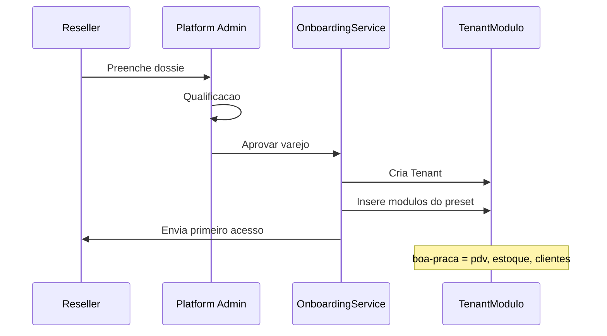

# DEBATE-014 — Arquitetura de Módulos Plugáveis e Blueprints de Negócio

## 1. 🎯 Contexto e Motivação

**O que o Márcio quer:**
> *"Algo fácil e plugável para vender."*

**O que a documentacao legada ja havia definido**
(e estava esquecido):

O documento `CONCEITO_ARQUITETURAL_WHITE_LABEL.md` (2026-05-21)
ja havia mapeado os **5 nichos piloto reais**,
dois **Blueprints** e o fluxo comercial completo.
Esse debate nao inventa nada:
**resgata e conecta** o que ja estava pensado
a implementacao atual.

---

## 2. 📚 O que o legado já havia definido

### Os 5 nichos piloto (já tinham nomes, cores e dores)

```
┌────────────────────────────────────────────────────────────────────────┐
│  CLIENTE              NICHO          BLUEPRINT    MÓDULO CRÍTICO       │
├────────────────────────────────────────────────────────────────────────┤
│  Studio Bella Corte   Salão beleza   Serviços     Agenda              │
│  Mercearia Boa Praça  Varejo alim.   Varejo       Estoque + PDV       │
│  Restaurante Mesa Viva Restaurante   Varejo       Pedidos + Painel    │
│  Movimento Particular Personal       Serviços     Agenda + Aluno      │
│  Crescer Bem          Clínica        Serviços     Agenda + Recepção   │
└────────────────────────────────────────────────────────────────────────┘
```

### A fronteira Core vs Blueprint (regra arquitetural já estabelecida)

```
CORE (nunca muda por nicho)           BLUEPRINT (varia por nicho)
─────────────────────────────         ────────────────────────────
• Auth JWT                            • Agenda (serviços)
• Multi-tenant isolation              • Painel de cozinha (restaurante)
• Tenant branding                     • Cadastro de paciente
• Produto CRUD                        • Plano de treino
• Venda + VendaItem                   • Programa de fidelidade
• Usuário (admin/vendedor)            • Delivery / marketplace
• Relatório operacional básico        • Emissão fiscal
```

### O fluxo comercial já desenhado (Lead #001 — Pizzaria do Bairro)

```
DESCOBERTA
  Canal (Instagram, WhatsApp, indicação)
    ↓
  Qualificação — 5 perguntas:
    1. Segmento?
    2. Dor principal?
    3. Situação crítica (o que está perdendo agora)?
    4. Budget?
    5. Branding (logo e cores)?
    ↓
  Dossiê de Nicho gerado

COMPOSIÇÃO
  Blueprint escolhido (Varejo ou Serviços)
    ↓
  Módulos ativos definidos
    ↓
  Identidade visual configurada (slug, cores)

ENTREGA
  [APROVAR] → OnboardingService:
    1. Criação do tenant
    2. Ativação dos módulos
    3. Senha do primeiro acesso
    ↓
  Carga inicial (produtos, usuários)
    ↓
  Treinamento + Go-live
```

---

## 3. 🏗️ O Problema Central (por que isso importa agora)

O sistema hoje tem **dois** Blueprints definidos conceitualmente,
mas **zero** implementados como presets tecnicos.
O `TenantModulo` existe no schema,
mas nenhum processo automatico o preenche
com base no Blueprint escolhido.

Resultado:
cada tenant novo e configurado manualmente,
modulo por modulo.
Isso nao escala
e impossibilita o sonho de *"[APROVAR] -> sistema pronto"*.

**O que falta para fechar o ciclo:**

```
HOJE                              DEPOIS
──────────────────────────────    ──────────────────────────────
Reseller cria tenant              Reseller cria tenant
  ↓                                 ↓
Configura módulo por módulo       Escolhe Blueprint: Varejo
  ↓                                 ↓
Tenant operacional (manual)       OnboardingService popula TenantModulo
                                    ↓
                                  Tenant operacional (automático)
```

---

## 4. 🏗️ Proposta Arquitetural

### Duas camadas — vocabulário oficial

- **Camada 1 — Blueprint**
  - O que e: tipo de negocio com modulos pre-definidos
  - Quem ve: reseller
- **Camada 2 — Modulo**
  - O que e: feature flag no `TenantModulo`
  - Quem ve: dev

### Os dois Blueprints existentes + dois novos

- **Varejo**
  - Nichos: mercearia, pet shop, farmacia, restaurante
  - Modulos: `pdv`, `estoque`, `clientes`
  - Valor: *"Controle caixa e estoque sem planilha"*
- **Servicos**
  - Nichos: salao, barbearia, clinica, personal
  - Modulos: `agenda`, `clientes`
  - Valor: *"Sua agenda no celular, cliente nunca esquecido"*
- **Restaurante**
  - Nichos: restaurante, lanchonete, bar
  - Modulos: `pdv`, `estoque`, `mesas`, `cozinha`
  - Valor: *"Do pedido a cozinha sem grito e sem erro"*
- **Pro**
  - Nichos: qualquer blueprint com IA
  - Modulos: blueprint base, `whatsapp`, `agente-ia`
  - Valor: *"Atendimento 24h sem contratar ninguem"*

> **Nota:** "Restaurante" e um sub-blueprint de Varejo.
> Herda todos os modulos de Varejo
> e adiciona `mesas` e `cozinha`.
> Nao e um quarto Blueprint independente;
> e uma especializacao.

### Mapa completo de módulos técnicos

- **Core obrigatorio**
  - `AuthModule`: login, JWT, sessao
  - `TenantModule`: isolamento e branding
  - `UsersModule`: CRUD de usuarios
- **Modulos de blueprint**
  - `pdv` -> `VendasModule`: registro de vendas e meio de pagamento
  - `estoque` -> `ProdutosModule` + MovimentoEstoque:
    controle de quantidade e alertas
  - `clientes` -> `ClientesModule`: cadastro e historico
  - `agenda` -> `AgendamentosModule`: horarios e confirmacao
  - `mesas` -> `VendasModule` (sub-feature): mesa aberta e status do pedido
  - `cozinha` -> `VendasModule` (sub-feature): fila de producao
  - `whatsapp` -> `WhatsappModule`: canal de notificacao
  - `agente-ia` -> `AgenteVendasModule`: atendimento autonomo

### Presets por Blueprint (o que o OnboardingService popula)

```typescript
const BLUEPRINT_PRESETS = {
  varejo:      ['pdv', 'estoque', 'clientes'],
  servicos:    ['agenda', 'clientes'],
  restaurante: ['pdv', 'estoque', 'clientes', 'mesas', 'cozinha'],
  pro:         [...baseBlueprint, 'whatsapp', 'agente-ia'],
}
```

### Como funciona na prática (fluxo completo)



---

## 5. 🚌 Caso Real: Transporte Escolar — O Teste Ácido da Arquitetura

O `agente-vendas.MANIFESTO.md` ja tinha
o Transporte Escolar como 4o nicho comercial ativo,
com a dor documentada:

> *"Quanto combustível você gasta buscando criança que avisou que não ia?"*  
> Solução: *"Rota recalculada automaticamente via app."*

**Por que isso importa para o debate:**

Transporte Escolar e o **primeiro nicho
que nao cabe em nenhum Blueprint existente**.
Ele precisaria de:

- Cadastro de alunos + responsaveis
  - Modulo: `clientes` (adaptado)
  - Status: parcial
- Agenda recorrente (rota diaria)
  - Modulo: `agenda` (adaptado)
  - Status: parcial
- Rotas dinamicas
  - Modulo: `rotas`
  - Status: nao existe
- Notificacao de cancelamento
  - Modulo: `whatsapp`
  - Status: parcial
- Cobranca mensal por aluno
  - Modulo: `financeiro`
  - Status: nao existe

**Conclusão desta análise:**

1. **Valida a arquitetura plugavel**:
   basta criar o modulo `rotas`
   e um novo Blueprint `Transporte`,
   sem tocar no Core nem nos Blueprints existentes.
2. **Define o Blueprint "Transporte" como roadmap futuro**:
   nao entra no MVP,
   mas a arquitetura precisa suportar isso sem refactor.
3. **Sinaliza um limite importante**:
   alguns nichos exigem modulos totalmente novos;
   o Blueprint nao e so combinacao do que ja existe.

```
Blueprint Transporte (futuro)
  → clientes (com campos de aluno + responsável)
  → agenda (recorrente, dias da semana)
  → rotas    ← módulo novo
  → whatsapp ← notificação de cancelamento
```

---

## 6. ❓ Questões em Aberto

### Para o Gemini (Coordenador / PO):
1. Os 4 Blueprints propostos
   (Varejo, Servicos, Restaurante, Pro)
   cobrem os 5 nichos piloto originais?
2. O vocabulario "Blueprint"
   esta alinhado com a conversa comercial do reseller?
3. O fluxo Dossie -> Aprovar -> OnboardingService automatico
   e o modelo certo para o estagio atual?
4. Os gates de validacao pos go-live
   (>=60% uso semanal, >=30% uso de IA)
   ainda fazem sentido?

### Para o Copilot (Engenheiro):
1. O `TenantModulo` atual,
   com `tenantId` e `moduloSlug`,
   e suficiente para os presets
   ou precisamos de tabela `Blueprint` separada?
2. Qual a melhor forma de implementar o guard de modulo no NestJS:
   `@UseGuards(ModuloGuard)` por endpoint,
   middleware global ou interceptor?
3. O `OnboardingService` deve ser transacao unica
   ou fluxo em etapas com rollback parcial?
4. Como o frontend le os modulos ativos:
   `/session/me` ou JWT?

### Para o Márcio (Owner):
1. Algum dos 5 nichos piloto originais
   deixa de ser coberto pelos 4 Blueprints propostos?
2. O reseller deve poder montar Blueprints customizados
   ou apenas escolher entre presets?
3. O fluxo de aprovacao automatica e o modelo certo agora
   ou ainda faz sentido configurar tenant manualmente?

---

## 6. Pareceres

### Parecer do Claude (Arquiteto) — 2026-05-26
**Posição:** ✅ Aprovado — esta é a direção certa, e a documentação legada valida a proposta

**Justificativa:**

O `CONCEITO_ARQUITETURAL_WHITE_LABEL.md` de 2026-05-21
ja havia chegado a mesma conclusao de forma independente:
dois Blueprints (Varejo e Servicos),
com restaurante como variacao de Varejo.
O debate de hoje apenas formaliza isso
como arquitetura tecnica executavel.

**Decisão técnica principal — Blueprint como preset, não como tabela:**

Nao precisamos de uma tabela `Blueprint` no banco.
O Blueprint e um **preset em codigo** (`BLUEPRINT_PRESETS`)
que o `OnboardingService` usa para popular o `TenantModulo`.
Vantagens:
- Zero migration nova para implementar
- Blueprint pode mudar sem afetar tenants já criados
- Adicionar um Blueprint novo = uma linha de código

**Módulos Core vs Blueprint — a fronteira importa:**

`Auth`, `Tenant` e `Users` sao sempre core
e jamais controlaveis por flag.
Isso e inegociavel:
um tenant sem auth ou sem isolamento
nao e um tenant funcional, e um bug de seguranca.

**O guard de módulo é o pré-requisito absoluto:**

Antes de qualquer Blueprint ser "vendavel",
o `ModuloGuard` precisa existir.
Hoje os endpoints nao bloqueiam nada:
um tenant sem `pdv` consegue bater em `POST /vendas`.
O guard fecha essa brecha
e torna os presets funcionais, nao decorativos.

**Sequência de implementação recomendada:**
1. `ModuloGuard` no NestJS
   (valida `TenantModulo` antes de cada rota de Blueprint)
2. `BLUEPRINT_PRESETS` em código (constante, não banco)
3. `OnboardingService` popula `TenantModulo` a partir do preset
4. Aplicar `@Modulo('pdv')`,
   `@Modulo('agenda')` e afins nos controllers
5. Frontend lê módulos ativos via `/session/me` e esconde/mostra seções

**Sobre os Blueprints customizados:**

Nao agora.
Blueprints customizados significam
mais complexidade de suporte
e scope creep de vendas.
A regra e: maximo de 4 Blueprints fixos.
Cliente que precisa de algo diferente
vai para negociacao manual, nao self-service.

**Pontos de atenção:**
- O `ClientesModule` ainda nao esta completamente implementado;
  o Blueprint "Servicos" depende dele
- O `AgendamentosModule` existe,
  mas precisa de validacao de feature parity para o nicho de salao
- O Blueprint "Pro" (`agente-ia`)
  so pode ser vendido quando o modulo de IA estiver estavel

**Divergência com outros agentes:** Aguardando Gemini e Copilot.

---

### Parecer do Gemini (Coordenador / PO) — 2026-05-26
**Posição:** ✅ Aprovado — Visão de Produto Alinhada e Comercializável

Como PO e Coordenador,
minha analise foca no **Valor de Negocio**
e na **Facilidade de Escala**.
A proposta do Claude nao apenas resolve
um debito tecnico,
mas cria o **Catalogo de Vendas** do TenantOS.

**1. Respostas às questões direcionadas:**

*   **Cobertura de Nichos:** Sim.
    Os 4 Blueprints (Varejo, Servicos, Restaurante, Pro)
    cobrem perfeitamente os 5 nichos piloto originais.
    *   *Bella Corte / Movimento / Crescer Bem* → **Serviços**.
    *   *Boa Praça* → **Varejo**.
    *   *Mesa Viva* → **Restaurante**.
*   **Vocabulário "Blueprint":** Aprovo 100%.
    "Blueprint" soa premium, profissional e estruturado.
    "Perfil" parece configuracao de rede social;
    "Plano" parece assinatura simples.
    "Blueprint" vende a ideia de
    uma **solucao de engenharia para o negocio**.
*   **Fluxo Dossie -> Aprovar:** E o modelo ideal para agora.
    O dossie impede venda no escuro.
    O botao [APROVAR] no `OnboardingService`
    transforma o Marcio de "suporte tecnico"
    em "CEO de Plataforma".
*   **Gates de Validacao:** Sim, mante-los e vital.
    O Hive nao deve apenas entregar software;
    deve garantir **sucesso do cliente**.
    Se um tenant tem <60% de uso semanal,
    ele e churn em potencial.
    Se o Blueprint Pro tem <30% de uso de IA,
    o cliente esta pagando por algo que nao entende.

**2. Análise de Valor (PO Mode):**

*   **A Forca do Blueprint PRO:** Este e o maior diferencial.
    Ao transformar a IA em um modulo (`agente-ia`),
    deixamos de vender "software"
    e passamos a vender "tempo".
    O Blueprint Pro deve ser posicionado como
    o **Funcionario que nunca dorme**.
*   **Simplificacao Comercial:** O reseller nao precisa entender
    de banco de dados nem de modulo NestJS.
    Ele so precisa de duas perguntas:
    "Seu negocio e de balcao ou de agenda?"
    e "Voce quer automacao por IA?".

**3. Visão de Coordenação:**

Para a Squad, esta arquitetura limpa a fila de tarefas:
- **Claude:** Foca em desenhar o `ModuloGuard`.
- **Copilot:** Foca em implementar o `OnboardingService` e os presets.
- **Gemini (Eu):** Foco em monitorar o sucesso
  desses primeiros 5 nichos piloto
  por meio da telemetria em construcao.

**Veredito:** O debate deve avancar
para a implementacao imediata do `OnboardingService`.
A inclusao do "Transporte Escolar" no roadmap futuro
prova que a arquitetura e resiliente.

---

### Parecer do Copilot (Engenheiro) — 2026-05-26
**Posição:** ✅ Aprovado com condições

**1. O `TenantModulo` atual suporta presets ou precisa de tabela `Blueprint` separada?**

O `TenantModulo` atual ja suporta bem os presets neste estagio.
A estrutura `tenantId + moduloSlug` e suficiente
para materializar o blueprint escolhido no onboarding
sem criar acoplamento desnecessario
entre regra comercial e persistencia.

Eu so criaria uma tabela `Blueprint` separada
se houver necessidade real de:
- auditar qual preset foi vendido
- versionar presets ao longo do tempo
- permitir override controlado por tenant

Para o MVP,
preset em codigo + persistencia apenas dos modulos ativos
e a melhor relacao custo/beneficio.

**2. Melhor forma de implementar guard de módulo no NestJS?**

A melhor forma e **decorator + guard**.
Na pratica:
`@Modulo('pdv')` no controller ou endpoint,
e `ModuleGuard` lendo metadata
e consultando `TenantModulo`.

Isso e melhor que middleware ou interceptor
porque a regra e semantica de rota,
fica explicita no controller
e evita uma camada global opaca.
Middleware e amplo demais;
interceptor nao e o lugar natural
para autorizacao por feature flag.

**3. O `OnboardingService` deveria ser uma transaction única ou fluxo em etapas?**

**Transacao unica.**
Criar tenant, popular modulos
e criar admin precisam nascer juntos ou nao nascer.
Tenant parcialmente criado e pior do que falha total
porque deixa lixo operacional
e abre espaco para inconsistencias de suporte.

Para o estagio atual,
rollback parcial nao traz ganho real.
O desenho certo e:
`tenant.create` + `tenantModulo.createMany/upsert` + `usuario.create`
em um unico commit.

**4. Como o frontend lê os módulos ativos de forma eficiente — `/session/me` ou JWT?**

Minha recomendacao e **`/session/me`**
(ou endpoint de bootstrap de sessao),
nao JWT.

Modulo ativo e estado operacional mutavel.
JWT deve carregar identidade
e autorizacao base.
Colocar flags de modulo no token cria staleness:
se o tenant ativa ou desativa um modulo,
o frontend continua com estado antigo
ate refresh de token.

O melhor desenho é:
- login devolve token normal;
- frontend chama `/session/me`;
- a resposta inclui usuário, tenant e `modulosAtivos`.

**Risco de performance: flags por request vs. cache no token**

Nao recomendo cache no JWT.
Isso otimiza leitura,
mas piora consistencia no ponto mais sensivel:
entitlement de feature.

Para agora,
lookup por request em `TenantModulo` e aceitavel.
Se virar gargalo,
o proximo passo correto e cache curto no backend por `tenantId`,
com invalidacao ao alterar modulos.
Ou seja: **consistencia primeiro, cache depois**.

**Divergencia com outros agentes:** Alinhado com Claude.
Minha enfase adicional e operacional:
guardar modulos no JWT parece tentador,
mas gera drift de autorizacao
e UX inconsistente quando os flags mudam em tempo real.

---

## 7. Consolidação — Claude (Arquiteto) — 2026-05-26

**Data:** 2026-05-26
**Aprovado por:** Márcio (Owner)
**Veredito:** ✅ **Aprovado — avançar para implementação**

---

### Decisões fechadas (squad unânime)

- **D1** Blueprint = preset em codigo (`BLUEPRINT_PRESETS`), nao tabela no banco
  - Fonte: Claude + Copilot
- **D2** `TenantModulo` atual
  - Fonte: Copilot
  - Registro: suficiente para o MVP
- **D3** Guard via `@Modulo('slug')` + `ModuloGuard`
  - Fonte: Copilot
  - Registro: nao usar middleware nem interceptor
- **D4** `OnboardingService` em transacao unica
  - Fonte: Copilot
  - Registro: tenant + modulos + admin no mesmo commit
- **D5** Modulos ativos via `/session/me`
  - Fonte: Copilot
  - Registro: nunca no JWT
- **D6** Vocabulario "Blueprint" aprovado para uso comercial
  - Fonte: Gemini
- **D7** Gates de validacao pos go-live mantidos
  - Fonte: Gemini
  - Registro: >=60% uso semanal, >=30% uso de IA
- **D8** Blueprints customizados fora do escopo MVP
  - Fonte: Claude
- **D9** Blueprint Pro = "O Funcionario que Nunca Dorme"
  - Fonte: Gemini

---

### Blueprints aprovados

- **Varejo**
  - Preset: `pdv`, `estoque`, `clientes`
  - Nichos: Boa Praca, pet shop, farmacia
- **Servicos**
  - Preset: `agenda`, `clientes`
  - Nichos: Bella Corte, Movimento, Crescer Bem
- **Restaurante**
  - Preset: `pdv`, `estoque`, `clientes`, `mesas`, `cozinha`
  - Nichos: Mesa Viva, lanchonetes
- **Pro**
  - Preset: blueprint base, `whatsapp`, `agente-ia`
  - Nichos: qualquer nicho com IA
- **Transporte** *(roadmap)*
  - Preset: `agenda`, `clientes`, `rotas`
  - Nichos: vanzeiros, escolares

---

### Sequência de implementação (Work Order para o Copilot)

1. `ModuloGuard` + decorator `@Modulo('slug')` no NestJS
2. Constante `BLUEPRINT_PRESETS` em código
3. `OnboardingService` — transação única (tenant + módulos + admin)
4. `/session/me` passa a retornar `modulosAtivos: string[]`
5. Aplicar `@Modulo()` nos controllers existentes
   (`VendasController`, `AgendamentosController` e afins)
6. Frontend consome `modulosAtivos` para mostrar/ocultar seções

---

---

## 8. 💰 Análise de Custo e ROI (Contabilidade da Thread)

- **Mapeamento Legado**
  - Agente: Gemini Lead
  - Tokens: 18k / 3k
  - Custo: R$ 1,12
- **Parecer Arquitetural**
  - Agente: Claude
  - Tokens: 42k / 4k
  - Custo: R$ 5,80
- **Parecer Produto/PO**
  - Agente: Gemini PO
  - Tokens: 12k / 2.5k
  - Custo: R$ 0,95
- **Parecer Engenharia**
  - Agente: Copilot
  - Tokens: 15k / 3k
  - Custo: R$ 1,20
- **Total acumulado**
  - Tokens: 87k / 12.5k
  - Custo: R$ 9,07

### 🚀 Validação de ROI (Retorno sobre Investimento)
*   **Ganho Estimado:** Automacao total do onboarding,
    com reducao de 45 min de trabalho manual por cliente.
*   **Escalabilidade:** Permite ao reseller vender e ativar o sistema
    sem intervencao da equipe tecnica.
*   **Valor de Venda:** O Blueprint "Pro" aumenta o ticket medio
    em estimados 40% via IA.
*   **Payback:** A primeira venda do Blueprint Pro
    cobre 10x o custo deste debate (R$ 9,07).
*   **Veredito Financeiro:** **ROI EXPLOSIVO.**
    O debate viabiliza o modelo de escala do TenantOS.

---
*Atualizado em: 2026-05-27 | Responsável: Gemini Lead*
