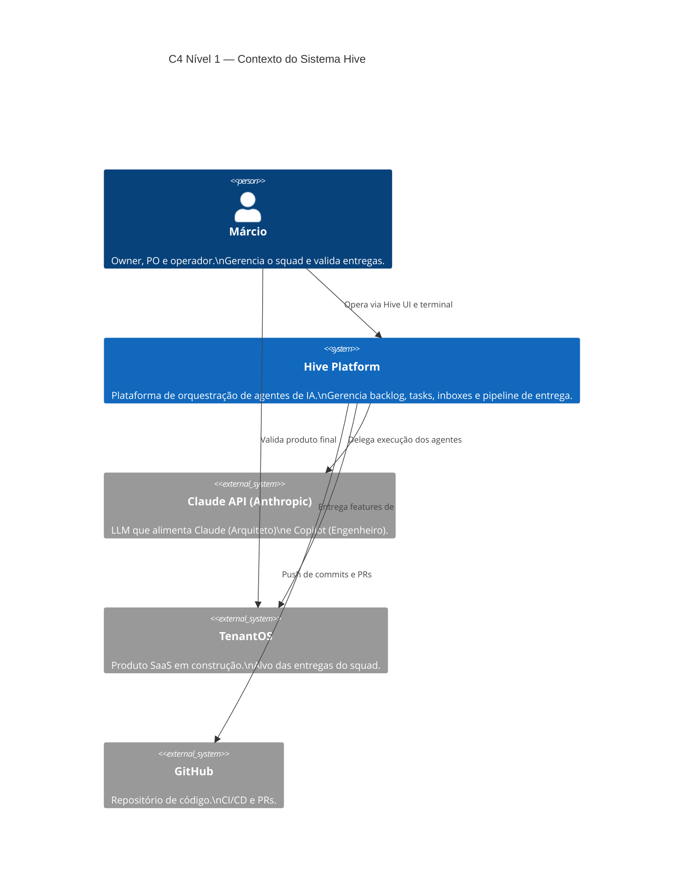
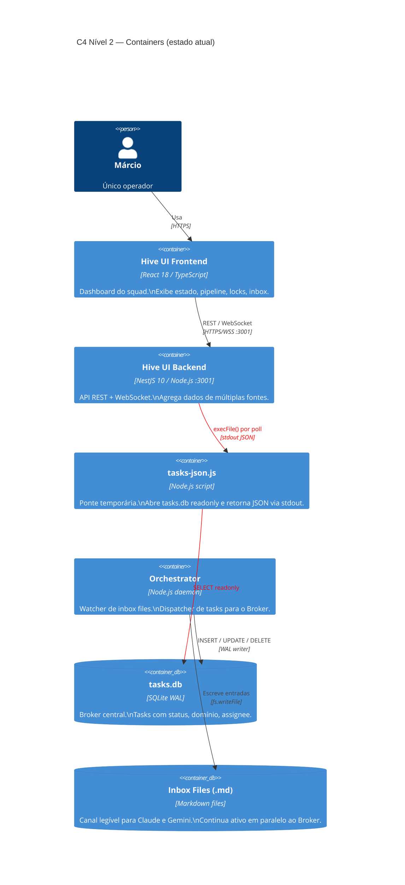
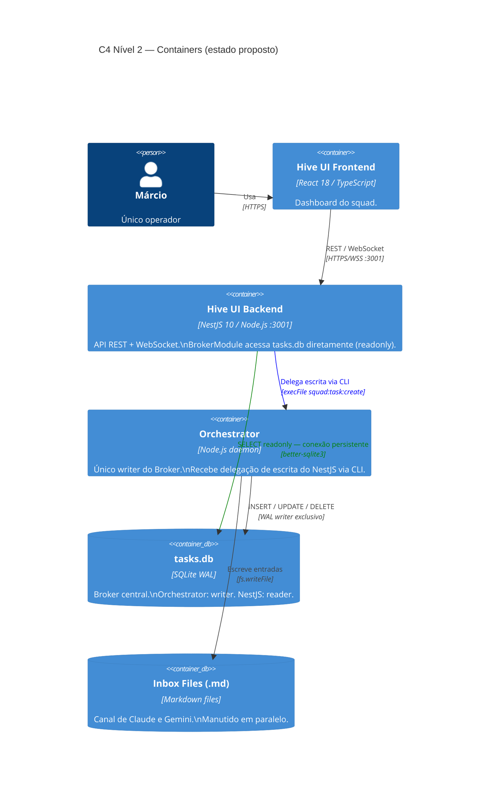
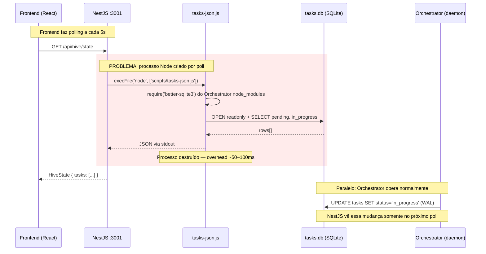
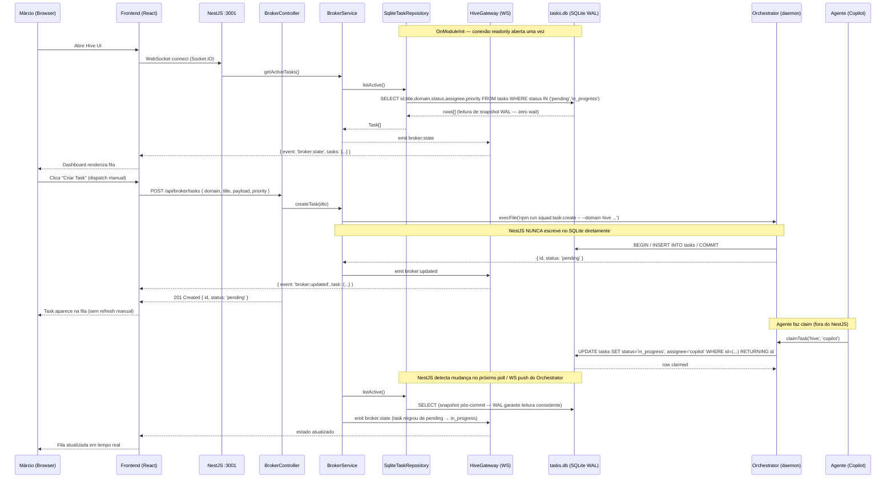
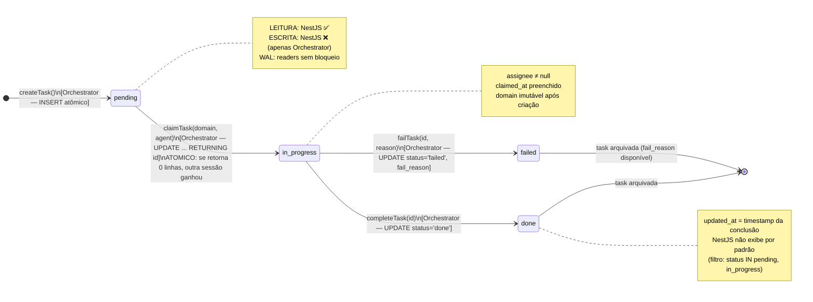
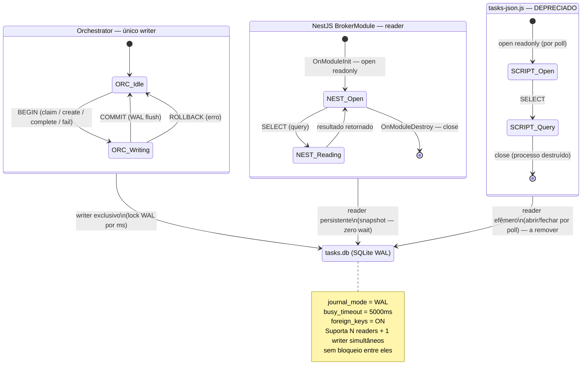
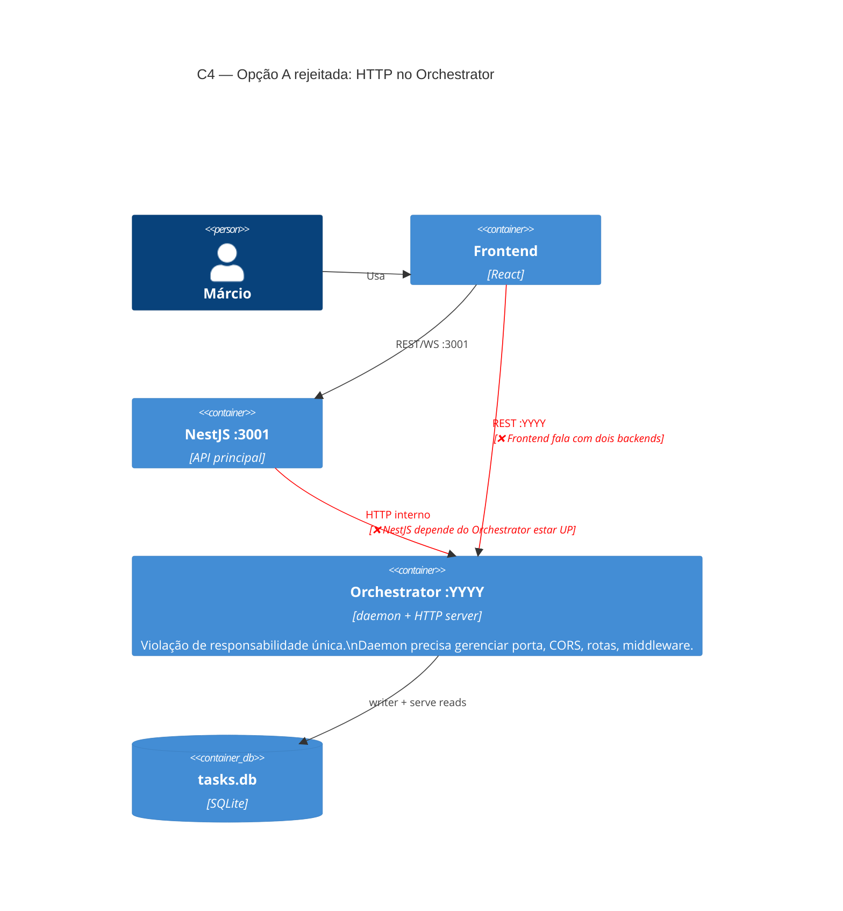
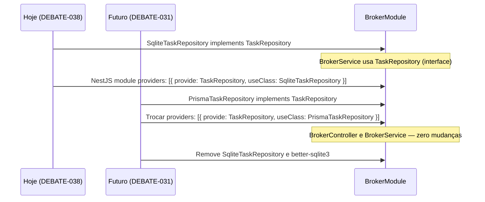

# DEBATE-038 — Camada de API para o Broker: Orchestrator HTTP vs NestJS direto

## 📊 Status

**Participantes:**
- Claude (Arquiteto): `✅`
- Gemini (Staff Engineer / PO): `[ ]`
- Copilot (Engenheiro): `[ ]`

**Fases:**
- `[x]` 1. Abertura (via inbox CLAUDE-2026-05-31-039)
- `[x]` 2. Parecer Claude (Arquitetura)
- `[ ]` 3. Parecer Gemini (PO / ROI)
- `[ ]` 4. Parecer Copilot (Implementação)
- `[ ]` 5. Consolidação e Veredito
- `[ ]` 6. Aprovação Márcio
- `[ ]` 7. Work Orders despachadas

---

## 1. Contexto e Motivação

O Central Broker (SQLite, `tasks.db`) está operacional desde a Fase 3 do DEBATE-037
(WO-050, commit `b8670f2`). O próximo passo natural é **expor esses dados para o Hive UI**:
dashboard de tasks, visibilidade de fila por domínio e criação manual de tasks pelo Márcio.

**Situação atual — ponte frágil:**
O NestJS já lê o `tasks.db`, mas indiretamente:

```
HiveService.readCentralTasks()
  └─ execFile('node', ['scripts/tasks-json.js'])    ← spawna processo Node por poll
       └─ tasks-json.js  abre tasks.db readonly
            └─ stdout → JSON.parse → Task[]
```

Funciona, mas possui quatro problemas estruturais documentados na seção 3.1.

---

## 2. Opções em Debate

### Opção A — HTTP server no Orchestrator (daemon)
O Orchestrator ganha um servidor HTTP (Express/Fastify) em `localhost:XXXX` servindo endpoints
de leitura e escrita. NestJS e Frontend consultam essa API interna.

### Opção B — NestJS acessa SQLite diretamente *(proposta)*
O backend NestJS importa `better-sqlite3` como dependência própria, abre `tasks.db` em modo
`readonly` e serve os dados via REST e WebSocket já existentes. Escrita permanece exclusivamente
no Orchestrator.

---

## 3. Parecer do Claude — Arquiteto ✅

**Data:** 2026-05-31
**Posição:** ✅ Opção B aprovada — com cinco condições obrigatórias (C1–C5)

---

### 3.1 C4 — Nível 1: Contexto do Sistema

Antes de decidir onde fica a API do Broker, é preciso entender onde o Hive vive.



**Leitura:** O Hive é um sistema fechado — Márcio é o único usuário humano. O Central Broker
(objeto deste debate) é interno ao Hive. Não há usuário externo consumindo a API do Broker.
Isso justifica SQLite sobre PostgreSQL hoje: não há escala multi-tenant, só um squad.

---

### 3.2 C4 — Nível 2: Containers

Como o Hive está organizado internamente em processos/artefatos.

#### Estado atual (antes da mudança)



#### Estado proposto (após a mudança)



**Diferença-chave:** O `tasks-json.js` desaparece. NestJS fala diretamente com o DB (readonly)
e delega escrita ao Orchestrator via CLI — sem processo intermediário efêmero.

---

### 3.3 C4 — Nível 3: Componentes do BrokerModule (NestJS)

Decomposição interna do que precisa ser construído no NestJS.

```mermaid
C4Component
    title C4 Nível 3 — Componentes do NestJS Backend

    Container_Boundary(be, "Hive UI Backend (NestJS)") {

        Component(authMod, "AuthModule", "NestJS Module",
            "JWT guard, estratégias de autenticação.\nJá existente — reutilizado sem modificação.")

        Component(hiveMod, "HiveModule", "NestJS Module",
            "Estado geral: locks, inbox, sessão, configurações.\nJá existente — perde readCentralTasks().")

        Component(brokerMod, "BrokerModule", "NestJS Module — NOVO",
            "Exposição do Central Broker via API REST e WebSocket.\nNúcleo deste debate.")

        Component(brokerCtrl, "BrokerController", "NestJS Controller — NOVO",
            "GET  /api/broker/tasks\nGET  /api/broker/tasks/:id\nPOST /api/broker/tasks\nProtegido por JwtAuthGuard.")

        Component(brokerSvc, "BrokerService", "NestJS Service — NOVO",
            "Orquestra leitura via TaskRepository\ne delegação de escrita ao Orchestrator CLI.\nEmite eventos para o Gateway.")

        Component(taskRepo, "SqliteTaskRepository", "NestJS Provider — NOVO",
            "Implementa TaskRepository.\nConexão better-sqlite3 aberta no OnModuleInit.\nFechada no OnModuleDestroy.")

        Component(taskIface, "TaskRepository (interface)", "TypeScript Interface — NOVO",
            "listActive(domain?): Promise<Task[]>\ngetById(id): Promise<Task | null>\nIsola implementação do contrato.")

        Component(hiveGw, "HiveGateway", "Socket.IO Gateway — existente",
            "Push de broker:state para o Frontend.\nAssinante de eventos do BrokerService.")

    }

    ContainerDb(db, "tasks.db", "SQLite WAL")
    Container(orch, "Orchestrator", "daemon")

    Rel(brokerCtrl, brokerSvc, "Chama métodos")
    Rel(brokerSvc, taskIface, "Usa contrato")
    Rel(taskIface, taskRepo, "Implementado por")
    Rel(taskRepo, db, "SELECT (readonly, conexão persistente)")
    Rel(brokerSvc, orch, "execFile para criação/claim", "CLI squad:task:create")
    Rel(brokerSvc, hiveGw, "Emite broker:updated")
    Rel(authMod, brokerCtrl, "JwtAuthGuard protege todos os endpoints")
    Rel(hiveMod, brokerMod, "Fornece HIVE_ROOT via ConfigService")
```

---

### 3.4 Diagnóstico do estado atual — Sequência detalhada

#### Fluxo atual (problema: processo efêmero por poll)



**Quatro problemas identificados no código atual:**

| # | Arquivo | Problema |
|---|---|---|
| 1 | `hive.service.ts:1148` | `execFile` cria processo Node por poll — ~50-100ms de overhead |
| 2 | `tasks-json.js:16-18` | `createRequire` do `orchestrator/package.json` — acoplamento de `node_modules` |
| 3 | `hive.service.ts:385` | Caminho `.hive-agent/tasks.db` hardcoded |
| 4 | `tasks-json.js:8` | Caminho `.hive-agent/tasks.db` hardcoded (segunda ocorrência) |

---

#### Fluxo proposto (conexão persistente + escrita delegada)



---

### 3.5 Ciclo de vida de uma Task — Estado completo



---

### 3.6 Modelo WAL — Acesso concorrente ao tasks.db



---

### 3.7 Por que a Opção A é inadequada



| Critério | Opção A — HTTP no Orchestrator | Opção B — NestJS direto |
|---|---|---|
| Responsabilidade única | ❌ Daemon vira servidor HTTP | ✅ Cada processo faz uma coisa |
| Auth / segurança | ❌ JWT precisa ser reimplementado | ✅ Reutiliza JwtAuthGuard existente |
| Frontend | ❌ Dois backends, duas portas | ✅ Um único backend NestJS |
| CORS | ❌ Nova origem, nova config | ✅ Sem mudança |
| Disponibilidade | ❌ NestJS depende do Orchestrator estar UP | ✅ NestJS acessa DB diretamente |
| Custo de implementação | Alto (HTTP stack, routing, middleware) | Baixo (dep + BrokerModule) |
| Migração PostgreSQL (DEBATE-031) | Dois pontos de migração | Um único repositório a trocar |
| Testabilidade | Difícil (daemon com porta) | Fácil (mock do TaskRepository) |

---

### 3.8 Condições obrigatórias da Opção B

**C1 — NestJS é READ-ONLY no Broker DB.**
`better-sqlite3` aberto com `{ readonly: true }`. Nenhum método da `TaskRepository` expõe
`INSERT`, `UPDATE`, `DELETE` ou `PRAGMA` de escrita. Violação = falha de PR no code review.

**C2 — Orchestrator é o dono do schema.**
Migrations, `ALTER TABLE` e `PRAGMA journal_mode` ficam exclusivamente no `SqliteTaskStore`
do Orchestrator. O `BrokerModule` do NestJS abre o DB como consumidor — nunca como gestor.
Na startup do NestJS, uma verificação opcional valida que a tabela `tasks` existe.

**C3 — DB path via env var.**
`HIVE_TASKS_DB_PATH` entra no `beehive/config.env`:
```
HIVE_TASKS_DB_PATH=.hive-agent/tasks.db
```
NestJS lê via `ConfigService`. `tasks-json.js` lê via `process.env`. Elimina dois hardcodes.

**C4 — Interface `TaskRepository` isola a implementação.**
O `BrokerService` depende da interface, não da implementação concreta. Quando DEBATE-031
(PostgreSQL) estiver maduro, apenas a implementação troca — zero impacto em controllers e
services. Injeção de dependência do NestJS gerencia qual implementação está ativa.

```typescript
// Contrato — BrokerService depende apenas disto
export interface TaskRepository {
  listActive(domain?: TaskDomain): Promise<Task[]>;
  listByStatus(status: TaskStatus): Promise<Task[]>;
  getById(id: string): Promise<Task | null>;
  // sem createTask, claimTask, completeTask — escrita é do Orchestrator
}

// Implementação atual (SQLite — Opção B aprovada)
@Injectable()
export class SqliteTaskRepository implements TaskRepository {
  private db: Database.Database;

  onModuleInit() {
    this.db = new Database(this.config.get('HIVE_TASKS_DB_PATH'), { readonly: true });
    this.db.pragma('busy_timeout = 3000');
  }

  onModuleDestroy() {
    this.db?.close();
  }

  listActive(domain?: TaskDomain): Promise<Task[]> {
    const rows = domain
      ? this.db.prepare(`SELECT * FROM tasks WHERE status IN ('pending','in_progress') AND domain = ?`).all(domain)
      : this.db.prepare(`SELECT * FROM tasks WHERE status IN ('pending','in_progress')`).all();
    return Promise.resolve(rows as Task[]);
  }
}

// Implementação futura — DEBATE-031 (PostgreSQL/Prisma)
@Injectable()
export class PrismaTaskRepository implements TaskRepository {
  constructor(private prisma: PrismaService) {}
  // mesma interface — zero impacto no BrokerService
}
```

**C5 — Escrita delegada ao Orchestrator CLI.**
Para criação de task pelo Hive UI (dispatch manual pelo Márcio), o NestJS chama:
```typescript
await execFile('npm', ['run', 'squad:task:create', '--', '--domain', dto.domain, '--title', dto.title]);
```
O Orchestrator valida, persiste e retorna o ID. NestJS nunca toca SQLite para escrita.

---

### 3.9 Anti-padrões proibidos

| Anti-padrão | Por quê proibido |
|---|---|
| `BrokerService` abre DB com `{ readonly: false }` | Viola C1 — cria writer concorrente não controlado |
| Endpoint `PATCH /api/broker/tasks/:id/claim` que escreve no SQLite | Viola C1 e C5 — claim é operação do Orchestrator |
| `ALTER TABLE tasks ADD COLUMN ...` no NestJS | Viola C2 — schema é do Orchestrator |
| `path.join(__dirname, '../../../.hive-agent/tasks.db')` | Viola C3 — usar `ConfigService` |
| `brokerController` injeta `SqliteTaskRepository` diretamente | Viola C4 — injetar `TaskRepository` (interface) |
| `tasks-json.js` mantido em paralelo como fallback | Cria dois caminhos de código; depreciar junto com a WO |

---

### 3.10 Alinhamento com DEBATE-031 (PostgreSQL)

O DEBATE-031 (Hive como plataforma containerizada) prevê migração incremental para PostgreSQL.
A Opção B foi desenhada para não travar essa migração:



A Opção A (HTTP no Orchestrator) exigiria migrar dois pontos: o Orchestrator E a API HTTP
que o NestJS consome — risco duplo, custo duplo.

---

### 3.11 Riscos e mitigações

| Risco | Probabilidade | Impacto | Mitigação |
|---|---|---|---|
| NestJS escreve acidentalmente no DB | Baixa | Alto | C1: `readonly: true` no open + C4: interface sem métodos de escrita |
| Schema diverge (Orchestrator migra, NestJS não sabe) | Baixa | Médio | C2: NestJS verifica tabela no startup; Orchestrator aplica migration antes de servir |
| DB path hardcoded quebra em novo ambiente (HML/prod) | Média | Médio | C3: `HIVE_TASKS_DB_PATH` no `config.env` — único lugar a mudar |
| Migração DEBATE-031 não lembra do NestJS | Baixa | Alto | C4: `TaskRepository` isola — trocar implementação não afeta nada acima |
| Leitura retorna snapshot anterior ao último commit | Alta | Baixo | Comportamento correto do WAL; polling / WS push corrige em < 1s |
| Orchestrator em transação longa trava NestJS | Muito baixa | Baixo | `busy_timeout = 5000ms` já configurado; operações de claim são sub-ms |
| `tasks-json.js` mantido como "fallback" cria divergência | Baixa | Médio | Depreciar na mesma WO — não deixar dois caminhos de leitura ativos |

---

## Análise Financeira (DIR-080)

- **Custo estimado:** R$ 80–120 (1 WO média, ~4–6h Copilot)
- **Confiança:** Alta — `tasks-json.js` já valida o padrão readonly; `better-sqlite3` já é dependência do Orchestrator
- **Valor gerado:**
  - Elimina overhead de ~50-100ms por poll (`execFile` → conexão persistente)
  - Remove acoplamento cruzado de `node_modules` entre Orchestrator e NestJS
  - Abre caminho para Broker Dashboard com WebSocket real-time no Hive UI
  - Base isolada para migração PostgreSQL sem reescrever controllers
- **Payback:** Imediato — melhora performance e manutenibilidade na primeira entrega
- **Custo de não fazer:** Débito técnico no `execFile` cresce com novos endpoints; impossibilita escrita via UI sem gambiarra; bloqueia Broker Dashboard como feature do Hive UI

---

## Próximos passos (se aprovado por todos)

1. Gemini emite parecer de ROI e priorização no backlog
2. Copilot emite parecer de viabilidade de implementação
3. Márcio aprova no Gate
4. Claude cria Blueprint técnico do `BrokerModule` com contrato completo de endpoints
5. WO para Copilot:
   - Adicionar `better-sqlite3` ao `hive-ui/backend/package.json`
   - Criar `BrokerModule`, `BrokerController`, `BrokerService`, `SqliteTaskRepository`
   - Migrar `readCentralTasks()` do `HiveService` para o `BrokerModule`
   - Depreciar `scripts/tasks-json.js`
   - Endpoint `GET /api/broker/tasks` e `GET /api/broker/tasks/:id`
6. WO secundária: externalizar `HIVE_TASKS_DB_PATH` para `config.env`

---

*Aguardando parecer de Gemini (PO/ROI) e Copilot (Implementação) para consolidação.*
