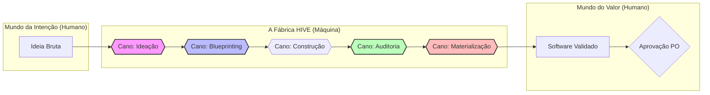

# 🐝 Topologia de Processos HIVE (O Mapa da Fábrica)

Este documento é o **Mapa da Fábrica** do framework HIVE. Ele descreve os processos mecânicos (Canos/Pipes) que transformam intenções de negócio em software de alta qualidade. É a ferramenta de suporte ao Product Owner (Márcio) para validar se a entrega final gerou o valor esperado.

---

## 🗺️ Fluxo Geral da Fábrica (Ponta a Ponta)

### 🚿 Regras Gerais dos Canos (HPP Standards)
- **Métrica Obrigatória:** Todo cano deve registrar seu custo estimado (tokens/tempo) no fechamento.
- **Saída Materializada:** Proibido finalizar sem DIR-070.

---

## 🧩 Catálogo de Processos (Os Canos)

### 1. 🧠 Cano: Ideação (Brainstorm)
*   ...
*   **📤 Saída:** `RESUMO_INTENCAO.md` + **Métrica de Concepção**.

### 2. 📐 Cano: Blueprinting (Arquitetação)
*   ...
*   **📤 Saída:** `BLUEPRINT.md` + **Métrica de Design**.

### 3. 🛡️ Cano: Auditoria & Sentinela (Governance)
*   ...
*   **📤 Saída:** Relatório de Integridade + **Métrica de Qualidade**.

### 🛠️ 5. Cano: Construção (Engenharia)
*   **Valor de Negócio:** Traduzir contratos técnicos em código funcional, performático e seguro de forma eficiente.
*   **📥 Entrada:** `BLUEPRINT.md` aprovado.
*   **⚙️ Regras (Guards):**
    - Proibido mudar o escopo do Blueprint sem novo debate.
    - Obrigatoriedade de testes unitários para lógica de negócio.
    - Seguir Conventional Commits (DIR-006).
*   **📤 Saída:** Código-fonte + Commits rastreáveis.
*   **⚖️ Critério de Aceite do PO:** *"As funcionalidades descritas no blueprint estão refletidas no comportamento do sistema?"*

### 🚪 6. Cano: The Gate (Afirmação Final)
*   **Valor de Negócio:** Blindar o histórico do repositório contra alterações não autorizadas pelo dono do produto.
*   **📥 Entrada:** Sucesso na Auditoria + Materialização concluída.
*   **⚙️ Regras (Guards):**
    - SOBERANIA HUMANA: Proibido commit sem "OK" do Márcio.
    - RASTREABILIDADE: Referenciar Issue e Agente no commit.
*   **📤 Saída:** Commit consolidado + Issue fechada no Board.
*   **⚖️ Critério de Aceite do PO:** *"Eu autorizo este trabalho a se tornar parte permanente do meu patrimônio técnico?"*

### 🎨 4. Cano: Materialização (Visão do Dono)
*   **Valor de Negócio:** Eliminar o "voo" do Owner sobre a tecnologia. Traduzir o terminal profundo em narrativa e visão de produto.
*   **📥 Entrada:** Sucesso na Auditoria + Artefato Técnico.
*   **⚙️ Regras (Guards):**
    - Proibido finalizar task sem Narrativa Humana.
    - Obrigatoriedade de Diagrama Visual Dual (Fluxo + Sequência).
*   **📤 Saída:** `MATERIALIZACAO_FULL.md` + **Status Report Final** em `registry/reports/`.

*   **⚖️ Critério de Aceite do PO:** *"Eu entendi o que foi feito, por que foi feito e como isso muda o meu produto?"*

---
## 🛠️ Como usar este Mapa
Este mapa é a referência máxima de funcionamento do Hive. Toda vez que uma tarefa for entregue para você como "Done", você deve abrir este mapa e verificar se o cano correspondente seguiu suas regras e gerou a saída esperada.
