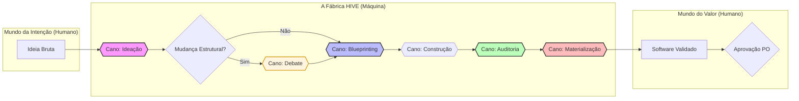

# 🐝 Topologia de Processos HIVE (O Mapa da Fábrica)

Este documento é o **Mapa da Fábrica** do framework HIVE. Ele descreve os processos mecânicos (Canos/Pipes) que transformam intenções de negócio em software de alta qualidade. É a ferramenta de suporte ao Product Owner (Márcio) para validar se a entrega final gerou o valor esperado.

---

## 🗺️ Fluxo Geral da Fábrica (Ponta a Ponta)

### 🚿 Regras Gerais dos Canos (HPP Standards)
- **Métrica Obrigatória:** Todo cano deve registrar seu custo estimado (tokens/tempo) no fechamento.
- **Saída Materializada:** Proibido finalizar sem DIR-070.
- **Trava do Arquiteto:** Mudanças na fundação (Auth, DB, Inter-agentes) exigem obrigatoriedade de passagem pelo **Cano: Debate** antes do Blueprint.

---

## 🧩 Catálogo de Processos (Os Canos)

### 1. 🧠 Cano: Ideação (Brainstorm)
*   **Valor de Negócio:** Reduzir o desperdício de tokens e tempo transformando desejos vagos em intenções lucrativas e tecnicamente viáveis.
*   **📥 Entrada:** Dores, desejos ou visões de produto soltas vindas do Owner.
*   **⚙️ Regras (Guards):** 
    - Proibido escrever código.
    - Obrigatoriedade de questionar o ROI e a escala da ideia.
    - Sincronia total com o `manifesto.md`.
*   **📤 Saída:** `RESUMO_INTENCAO.md` + **Métrica de Concepção**.
*   **⚖️ Critério de Aceite do PO:** *"Este resumo reflete exatamente o que eu quero construir, e o Hive entendeu o valor por trás da ideia?"*

### 🗣️ 2. Cano: Debate (Arquitetura)
*   **Valor de Negócio:** Blindar o sistema contra decisões técnicas míopes ou de alto risco através do consenso entre especialistas (Arquiteto, Engenheiro, Lead).
*   **📥 Entrada:** `RESUMO_INTENCAO.md` com flag "Estrutural".
*   **⚙️ Regras (Guards):**
    - Participação obrigatória do **Arquiteto (Claude)**.
    - Análise obrigatória de impacto em segurança e escalabilidade.
    - Registro formal de alternativas descartadas.
*   **📤 Saída:** `DEBATE-NNN.md` com Veredito Consolidado + **Métrica de Decisão**.
*   **⚖️ Critério de Aceite do PO:** *"Os especialistas concordam que esta é a solução mais segura e escalável para o meu produto?"*

### 📐 3. Cano: Blueprinting (Arquitetação)
*   **Valor de Negócio:** Blindar o sistema contra bugs estruturais e debito técnico através de um desenho rigoroso antes de qualquer linha de código.
*   **📥 Entrada:** `RESUMO_INTENCAO.md` amadurecido (+ Veredito de Debate se estrutural).
*   **⚙️ Regras (Guards):**
    - Proibido implementação física (execução).
    - Obrigatoriedade de diagramas de sequência/entidade (Mermaid).
    - Definição clara de Contratos de Entrada/Saída.
*   **📤 Saída:** `BLUEPRINT.md` + **Métrica de Design**.
*   **⚖️ Critério de Aceite do PO:** *"Este desenho atende aos requisitos de negócio e parece robusto o suficiente para ser construído?"*

### 🛡️ 4. Cano: Auditoria & Sentinela (Governance)
*   **Valor de Negócio:** Garantir a soberania do Owner e a integridade do código, impedindo que "sujeira" ou erros de governança entrem no repositório.
*   **📥 Entrada:** Código gerado + Blueprint correspondente.
*   **⚙️ Regras (Guards):**
    - Uso obrigatório do `npm run hive:check`.
    - Bloqueio se faltar evidência de teste.
    - Sincronia obrigatória entre Kernel e Obra (DIR-035).
*   **📤 Saída:** Relatório de Integridade + **Métrica de Qualidade**.
*   **⚖️ Critério de Aceite do PO:** *"O sistema me provou (com evidências) que o código é seguro e segue as minhas regras?"*

### 🛠️ 5. Cano: Construção (Engenharia)
*   **Valor de Negócio:** Traduzir contratos técnicos em código funcional, performático e seguro de forma eficiente.
*   **📥 Entrada:** `BLUEPRINT.md` aprovado.
*   **⚙️ Regras (Guards):**
    - Proibido mudar o escopo do Blueprint sem novo debate.
    - Obrigatoriedade de testes unitários para lógica de negócio.
    - Seguir Conventional Commits (DIR-006).
*   **📤 Saída:** Código-fonte + Commits rastreáveis.
*   **⚖️ Critério de Aceite do PO:** *"As funcionalidades descritas no blueprint estão refletidas no comportamento do sistema?"*

### 🚪 6. Cano: The Gate (Afirmação Final)
*   **Valor de Negócio:** Blindar o histórico do repositório contra alterações não autorizadas pelo dono do produto.
*   **📥 Entrada:** Sucesso na Auditoria + Materialização concluída.
*   **⚙️ Regras (Guards):**
    - SOBERANIA HUMANA: Proibido commit sem "OK" do Márcio.
    - RASTREABILIDADE: Referenciar Issue e Agente no commit.
*   **📤 Saída:** Commit consolidado + Issue fechada no Board.
*   **⚖️ Critério de Aceite do PO:** *"Eu autorizo este trabalho a se tornar parte permanente do meu patrimônio técnico?"*

### 🎨 7. Cano: Materialização (Visão do Dono)
*   **Valor de Negócio:** Eliminar o "voo" do Owner sobre a tecnologia. Traduzir o terminal profundo em narrativa e visão de produto.
*   **📥 Entrada:** Sucesso na Auditoria + Artefato Técnico.
*   **⚙️ Regras (Guards):**
    - Proibido finalizar task sem Narrativa Humana.
    - Obrigatoriedade de Diagrama Visual Dual (Fluxo + Sequência).
*   **📤 Saída:** `MATERIALIZACAO_FULL.md` + **Status Report Final** em `registry/reports/`.
*   **⚖️ Critério de Aceite do PO:** *"Eu entendi o que foi feito, por que foi feito e como isso muda o meu produto?"*

---
## 🛠️ Como usar este Mapa
Este mapa é a referência máxima de funcionamento do Hive. Toda vez que uma tarefa for entregue para você como "Done", você deve abrir este mapa e verificar se o cano correspondente seguiu suas regras e gerou a saída esperada.
