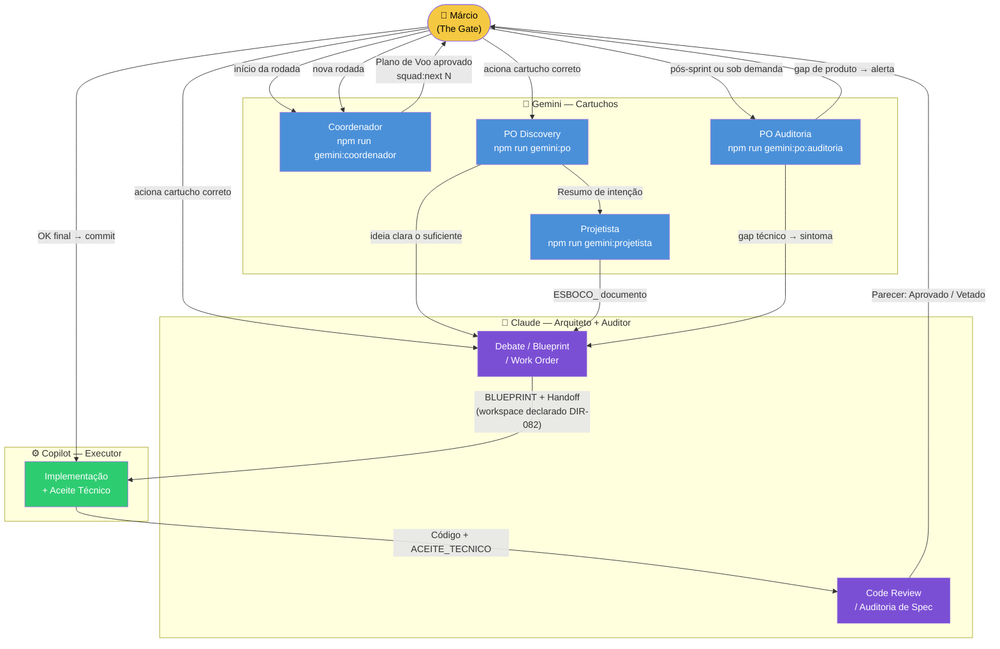
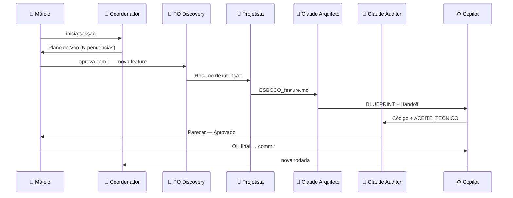
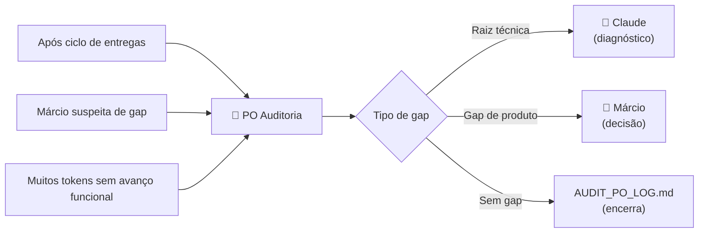

# Fluxo de Interações — Cartuchos do Squad

> **Para quê serve este documento:** mostrar o que cada cartucho/agente produz ao final de uma interação e qual é a próxima interação esperada. Use para identificar rapidamente onde o fluxo travou ou qual passo está faltando.

---

## Diagrama Geral do Fluxo



---

## Por Cartucho — O que entra, o que sai, o que vem depois

### 🐝 Coordenador
```
ENTRADA:
  npm run squad:inbox   → resumo de pendências de todos os inboxes
  BACKLOG.md            → itens não concluídos (sob demanda)
  session-state.env     → estado atual do squad

DURANTE A INTERAÇÃO:
  → Lê pendências em silêncio (Auto-Audit)
  → Monta Plano de Voo numerado com agente responsável
  → PARA e aguarda Márcio

SAÍDA:
  Plano de Voo (apenas em chat — não escreve arquivo)

PRÓXIMA INTERAÇÃO:
  Márcio aprova o plano → aciona o item 1 manualmente
  ou usa: npm run squad:next <N>  (quando implementado)

GAPS COMUNS AQUI:
  ✗ Coordenador age sem esperar Márcio aprovar o Plano de Voo
  ✗ Coordenador escreve em arquivos de regra ao "corrigir" o que lê
  ✗ Plano de Voo sem referência ao debate/handoff de origem
```

---

### 🐝 PO — Discovery
```
ENTRADA:
  manifesto.md                  → critério de valor
  brainstorm-ativa.md           → input bruto do Márcio (sob demanda)

DURANTE A INTERAÇÃO:
  → Filtra: "isso resolve uma dor real?"
  → Questiona escopo e complexidade
  → Mapeia: Valor Esperado / Público-Alvo / Riscos de Negócio

SAÍDA:
  Resumo de intenção (ideação)  → salvo em cognition/intuition/brainstorm/
  ou diretamente no chat se for rápido

PRÓXIMA INTERAÇÃO:
  A → Projetista: se a ideia precisa ser desenhada em fluxo/diagrama
  B → Claude:     se a ideia já tem forma clara e precisa de spec técnica

GAPS COMUNS AQUI:
  ✗ PO avança para design sem Márcio confirmar a direção
  ✗ Resumo de intenção fica só no chat (não versionado)
  ✗ PO tenta criar handoff para Copilot (não é sua função)
```

---

### 🐝 PO — Auditoria
```
ENTRADA:
  BACKLOG.md                    → o que foi prometido
  blueprints ativos             → critérios de aceite originais
  beehive/registry/aceites/     → aceites técnicos do período
  PRONTO.md (quando existir)    → critérios objetivos de "done"

DURANTE A INTERAÇÃO:
  → Cruza prometido vs entregue
  → Identifica gaps (sem diagnóstico técnico)
  → Classifica: gap de produto OU raiz técnica suspeita

SAÍDA:
  Relatório de gaps             → append em AUDIT_PO_LOG.md
  Entrada no inbox do Claude    → apenas se gap tiver raiz técnica
  Entrada no inbox do Márcio    → apenas se gap for de produto puro

PRÓXIMA INTERAÇÃO:
  A → Claude:   recebe sintoma técnico, faz diagnóstico, decide se vai ao Copilot
  B → Márcio:   decide sobre gap de produto (priorizar, descartar, aceitar risco)
  C → Nenhuma:  se não há gaps, encerra e registra no log

GAPS COMUNS AQUI:
  ✗ PO emite diagnóstico técnico em vez de só sinalizar o sintoma
  ✗ Auditoria sem PRONTO.md → critérios subjetivos → ruído
  ✗ Gap reportado no chat mas não registrado no AUDIT_PO_LOG.md
```

---

### 🐝 Projetista
```
ENTRADA:
  manifesto.md                  → DNA do HIVE
  Resumo de intenção do PO      → o que precisa ser desenhado
  active-processes.md           → o que já existe (evitar reinventar)

DURANTE A INTERAÇÃO:
  → Transforma intenção em fluxos, diagramas, jornada do usuário
  → Aguarda feedback do Márcio antes de consolidar
  → Não avança sozinho

SAÍDA:
  ESBOCO_[tema].md              → salvo em beehive/docs/materializacao/
  Diagramas Mermaid inline      → parte do esboço

PRÓXIMA INTERAÇÃO:
  → Claude: recebe ESBOCO_, valida, transforma em BLUEPRINT_ executável
  Claude pode pedir revisão → Projetista ajusta → Claude valida novamente
  (máximo 2 ciclos; se persistir, Márcio decide)

GAPS COMUNS AQUI:
  ✗ Projetista cria arquivo com prefixo BLUEPRINT_ (é do Claude)
  ✗ Esboço vai direto para Copilot sem passar pelo Claude
  ✗ Projetista consolida sem esperar feedback do Márcio
```

---

### 🧠 Claude — Arquiteto
```
ENTRADA:
  ESBOCO_ do Projetista         → para transformar em Blueprint
  ou inbox-claude.md pendente   → debate, análise, work order
  ou ideia direta do Márcio     → quando não precisa do fluxo PO → Projetista

DURANTE A INTERAÇÃO:
  → Valida viabilidade técnica do esboço
  → Especifica: BLUEPRINT_ com DTOs, contratos, critérios de aceite
  → Emite parecer com Análise Financeira (DIR-080)
  → Monta Handoff executável para o Copilot (com DIR-082 se multi-repo)

SAÍDA:
  BLUEPRINT_[tema].md           → em beehive/construcao/blueprints/
  Handoff para Copilot          → entrada em inbox-copilot.md
  Parecer em debate             → na seção do Claude do arquivo de debate

PRÓXIMA INTERAÇÃO:
  → Copilot: recebe handoff, implementa o contrato
  Se Copilot retorna com dúvida → Claude responde → Copilot retoma
  (máximo 2 ciclos; se persistir, Márcio decide)

GAPS COMUNS AQUI:
  ✗ Blueprint sem Análise Financeira (DIR-080)
  ✗ Handoff multi-repo sem workspace declarado (DIR-082)
  ✗ Claude executa código de produto (é função do Copilot)
```

---

### 🧠 Claude — Auditor Técnico
```
ENTRADA:
  Código entregue pelo Copilot  → para code review
  Spec ou Blueprint              → para auditoria antes da execução
  Sintoma técnico do PO Auditoria → para diagnóstico

DURANTE A INTERAÇÃO:
  → Revisa código: corretude, arquitetura, segurança, débito técnico
  → Emite parecer: Aprovado / Vetado / Aprovado com ressalvas
  → Se ressalva = débito técnico → registra antes de dar OK

SAÍDA:
  Parecer de code review        → no chat ou inbox-copilot.md se exige ajuste
  Aceite de auditoria           → OK formal para The Gate

PRÓXIMA INTERAÇÃO:
  A → Márcio (The Gate): Claude deu OK → Márcio aprova commit
  B → Copilot: Claude vetou ou tem ressalvas → Copilot corrige → Claude re-audita
  (máximo 2 ciclos; se persistir, Márcio decide)

GAPS COMUNS AQUI:
  ✗ Claude audita o próprio trabalho (conflito de interesse)
  ✗ Débito técnico identificado mas não registrado antes do OK
  ✗ OK formal sem evidência observável (build, test, smoke)
```

---

### ⚙️ Copilot — Executor
```
ENTRADA:
  Handoff do Claude             → contrato 100% fechado
  inbox-copilot.md pendente     → work order ou tarefa

DURANTE A INTERAÇÃO:
  → Implementa o contrato (sem redefinir escopo)
  → Para e escala para Claude se contrato estiver ambíguo
  → Gera Aceite Técnico antes do commit (DIR-081)

SAÍDA:
  Código implementado           → commit rastreável
  ACEITE_TECNICO_[tema].md      → em beehive/registry/aceites/
  Entrada em inbox-claude.md    → "entregue, pronto para revisão"

PRÓXIMA INTERAÇÃO:
  → Claude (Auditor): faz code review da entrega
  Se Claude aprova → Márcio faz OK final → Copilot commita
  Se Claude veta → Copilot corrige → Claude re-audita

GAPS COMUNS AQUI:
  ✗ Commit antes do Aceite Técnico
  ✗ Copilot redefine escopo durante implementação
  ✗ Entrega sem evidência (sem smoke, sem build validado)
  ✗ Handoff multi-repo sem workspace declarado → busca no filesystem
```

---

### 👤 Márcio — The Gate
```
ENTRADA:
  Parecer do Claude (Auditor)   → OK formal
  Aceite Técnico do Copilot     → evidência de entrega

DECISÕES:
  ✅ Aprovar → Copilot commita → Coordenador abre próxima rodada
  ❌ Vetar → volta para Claude com motivo
  ⚠️ Condicionar → define o que falta para aprovar

PRÓXIMA INTERAÇÃO:
  → Coordenador: nova rodada começa com Plano de Voo atualizado

GAPS COMUNS AQUI:
  ✗ Commit sem OK explícito do Márcio
  ✗ Aceite Técnico não lido antes do OK
  ✗ Débito técnico aprovado sem registro rastreável
```

---

## Sequência Típica de uma Rodada Completa



---

## Quando acionar PO Auditoria


