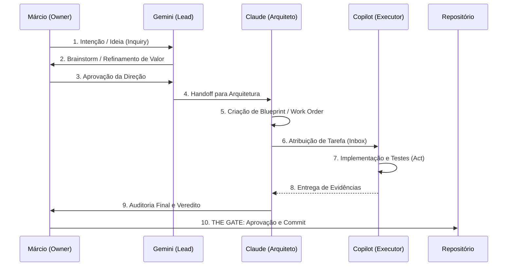
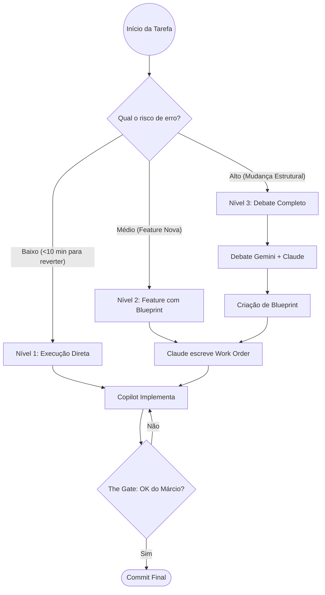

# 🐝 Hive Framework — Documentação Oficial
**Versão:** 1.0.0 | **Status:** Estável | **Data:** 2026-05-26

---

## 1. O que é o Hive?

O **Hive Framework** é um Sistema Operacional para Desenvolvimento Simbiótico (IA + Humano). Ele organiza o caos de trabalhar com múltiplas LLMs (Gemini, Claude, Copilot) ao mesmo tempo, atribuindo papéis fixos, responsabilidades claras e processos auditáveis.

Diferente de assistentes de codificação comuns, o Hive opera como um **Squad de Software Autônomo** onde o desenvolvedor humano atua como **Owner e Maestro**, mantendo a soberania final sobre cada linha de código produzida.

---

## 2. A Equipe (Os 4 Atores)

O framework divide a inteligência em quatro papéis fundamentais para garantir qualidade e evitar conflitos de interesse:

| Ator | Papel | Responsabilidade Principal |
| :--- | :--- | :--- |
| **Márcio** | **Owner / The Gate** | Define a visão, aprova orçamentos de tokens e é a única autoridade de commit. |
| **Gemini** | **Facilitador Estratégico** | Atua na camada de valor (PO), design de solução (Projetista) e planejamento (Coordenador). |
| **Claude** | **Arquiteto / Auditor** | Transforma intenções em especificações técnicas (Blueprints) e audita a entrega do Copilot. |
| **Copilot** | **Engenheiro / Executor** | Implementa o código via terminal, seguindo estritamente os contratos fechados. |

---

## 3. O Fluxo de Trabalho (Sequence Diagram)

O diagrama abaixo ilustra como uma ideia do Owner atravessa o Squad até se tornar código no repositório.

Como padrão transversal de operação, toda interação de fluxo ativo no Hive — inbox, handoff, status, checkpoint, auditoria e pedido de aprovação — deve encerrar com **Estado atual**, **Próximo passo** e **Ação esperada**. Ref: `beehive/construcao/PADRAO_SAIDA_OPERACIONAL_HIVE.md`

---

## 4. Níveis de Operação (Decision Flow)

Nem toda tarefa exige o processo completo. O Hive adapta-se à complexidade do problema:

---

## 5. Estrutura do Repositório (`beehive/`)

O framework reside na pasta `beehive/`, mantendo a inteligência separada do código do produto:

- **`dna/`**: Princípios fundamentais e topologia de processos.
- **`roles/`**: Definições de persona e capacidades de cada agente.
- **`construcao/`**: Inboxes (canais de comunicação) e Blueprints ativos.
- **`registry/`**: Telemetria de custo, histórico de debates e evidências de entrega.
- **`bin/`**: Scripts de utilidade para gestão do squad.

---

## 6. Diferenciais do Hive

- **Anti-Conflito de Interesse:** O agente que especifica (Claude) não é o mesmo que executa (Copilot), garantindo auditoria real.
- **Higiene de Contexto:** Processos de "context flush" evitam que a IA carregue lixo técnico em discussões estratégicas.
- **Telemetria de Custo:** Registro granular do custo de cada decisão tomada pela IA.
- **The Gate Protocol:** Segurança absoluta contra commits automatizados indesejados.

---
*Assinado: Squad Hive OS — 2026*
