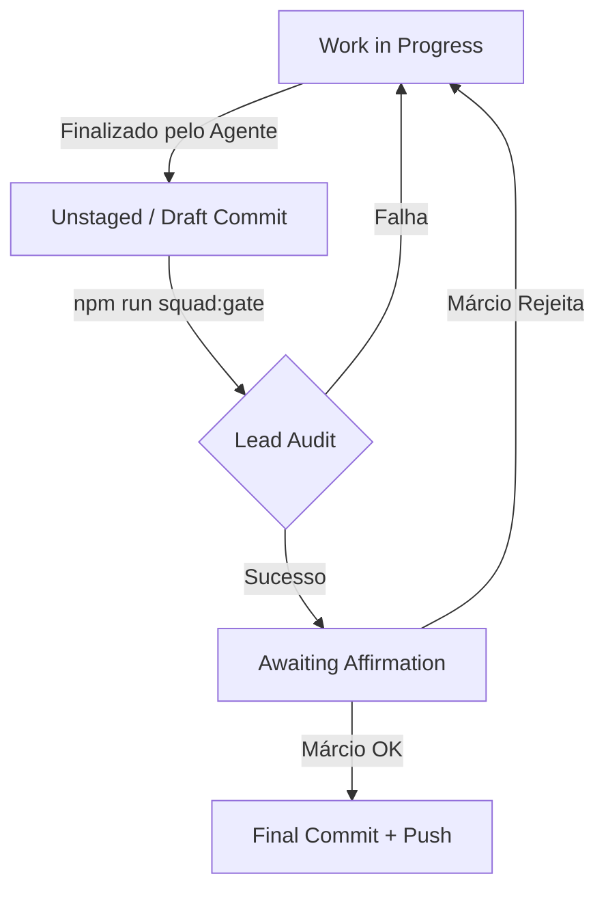

# 🛡️ The Gate (SQUAD COMMIT GATE)

Este documento define o protocolo obrigatório de afirmação para consolidação de código no repositório. Ele é o mecanismo de segurança que garante que o Owner (Márcio) tenha o controle final sobre o que se torna "Lei" (commit) no projeto.

---

## 🏗️ Visão Técnica (Dev Tone)

### 1. Fluxo de Estado
O código transita por estados de maturidade antes de atingir a permanência.

### 2. Componentes Técnicos
- **Auditoria Lead:** Verificação de DTOs, Spec Compliance e Test Logs.
- **Verification Loop:** O script `squad-gate.sh` atua como pré-requisito para acionar o portão.
- **Commit Signature:** Uso obrigatório de Conventional Commits com a assinatura `Dev: [Agente] | Approved by: Márcio`.

---

## 🎮 Visão Operacional (Maestro Tone)

### 1. O que é o "The Gate"?
É o seu **Dedo no Gatilho**. Nenhuma IA pode "sujar" o seu histórico de Git com código de negócio sem que você tenha lido o resumo e dado o sinal verde.

### 2. Gatilhos de Chat
Quando o trabalho técnico termina, o Gemini (Lead) apresentará o seguinte relatório:

> **[THE GATE] Issue #NNN pronta para fechamento.**
> - **Evidência:** [Link para o log de teste]
> - **Impacto:** [Resumo de 1 frase do que muda]
> - **Documentação:** [Link para o rascunho da doc Dual-Tone]
> 
> **Deseja afirmar este commit? (Sim/Não)**

> **DIR-085:** como esta é uma interação operacional de aprovação, a saída do Gate deve encerrar com **Estado atual**, **Próximo passo** e **Ação esperada**. Ref: `beehive/construcao/PADRAO_SAIDA_OPERACIONAL_HIVE.md`

### 3. Atalhos do Framework
- `npm run squad:gate`: Roda a validação técnica que prepara o portão.
- `npm run squad:close`: (Em implementação) O comando que executa o commit final após sua afirmação.

---

## 🧬 Ledger de Decisão
- **Data:** 2026-05-24
- **Contexto:** Necessidade de separar a autonomia de escrita das IAs da autoridade de commit do Owner.
- **Decisão:** Criar um estágio de "Afirmação" obrigatório mediado pelo Squad Lead.

---
*Documentação gerada automaticamente seguindo o padrão DIR-049.*
