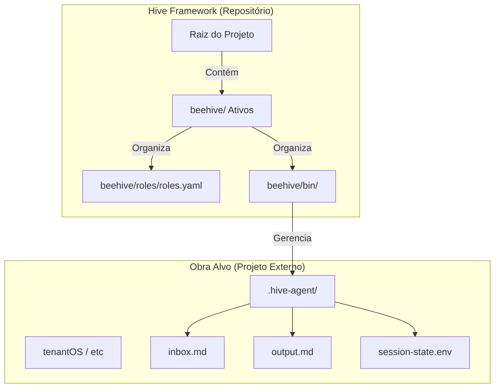
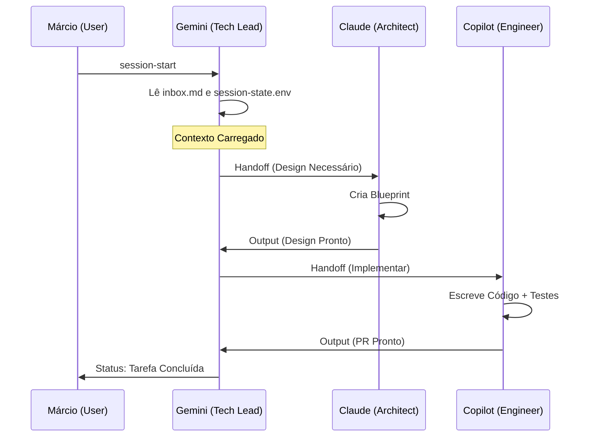

# Engenharia do Hive Framework: Fluxo de Orquestração e Pontes

Este documento detalha a arquitetura operacional do Hive, explicando como os agentes (Gemini, Claude, Copilot) se comunicam, como o contexto é preservado e como o framework se acopla a diferentes projetos (Obras).

---

## 1. O Conceito de "Ponte" (.hive-agent)

A **Ponte de Agentes** é o coração da comunicação assíncrona do Squad. Ela é materializada por uma pasta chamada `.hive-agent` na raiz de qualquer projeto gerenciado pelo Hive (incluindo o próprio repositório do Framework).

---

## 2. Ciclo de Vida de uma Sessão

O fluxo foi desenhado para evitar a "Amnésia de Contexto" e garantir que um agente saiba exatamente onde o outro parou.

1.  **Bootstrap (`session-start`):**
    - O agente é iniciado.
    - O script detecta o diretório do projeto.
    - A ponte `.hive-agent` é validada/criada.
    - O agente lê o `inbox.md` para ver se há tarefas pendentes para seu papel.

2.  **Execução:**
    - O agente atua conforme seu **Cartucho de Inteligência** (PO, Projetista ou Tech Lead).
    - Se precisar realizar uma mudança, ele solicita um **Lock** para evitar conflitos com outros agentes.
    - Insights capturados durante a execução são enviados para o `insights-buffer.md`.

3.  **Handoff (Passagem de Bastão):**
    - Ao final da tarefa, o agente escreve no `output.md`.
    - Se a tarefa exigir que outro agente continue (ex: Claude desenhou, Copilot precisa codar), um novo item é criado no `inbox.md` destinado ao próximo agente.

---

## 3. Matriz de Papéis (Cartuchos)

O Hive opera sob uma governança estrita definida em `beehive/roles/roles.yaml`:

| Agente | Papel | Responsabilidade Principal |
|---|---|---|
| **Gemini** | **Tech Lead** | Orquestração, triagem de bugs, auditoria e geração de documentos técnicos. |
| **Claude** | **Arquiteto** | Design de soluções, criação de Blueprints e tomada de decisão estrutural. |
| **Copilot** | **Engenheiro** | Implementação de código, execução de testes e correção de bugs pontuais. |

---

## 4. Portabilidade (A "Obra" Independente)

O Hive Framework é uma entidade autônoma residente neste repositório. A pasta `beehive/` serve como o diretório de ativos técnicos (binários e configurações) que alimentam o motor de orquestração.

- Quando operando no próprio repositório `hive`, a autoridade é a raiz.
- Quando operando em projetos externos, o Framework lê suas regras globais em `beehive/`, mas aplica as ações na raiz do projeto onde a sessão foi iniciada.

---

## 5. Comandos de Engenharia

| Comando | Função Técnica |
|---|---|
| `hive status` | Lê o `roles.yaml` e a ponte para mostrar o painel de controle. |
| `hive session-start` | Carrega o driver do agente e limpa o buffer de contexto. |
| `hive insight` | Alimenta o buffer criativo sem interromper o fluxo de código. |
| `hive gate` | Compara o estado atual do código contra o contrato definido na tarefa. |

---

## 6. Filosofia de Segurança e Lock

Para evitar que dois agentes editem o mesmo arquivo simultaneamente:
- O sistema de **Lock** cria um arquivo temporário `.lock` no diretório da ponte.
- Nenhum agente tem permissão de escrita em arquivos de código se não possuir o Lock ativo para aquela Issue.

---
*Documento gerado automaticamente pelo Gemini (Tech Lead) em 2026-05-26.*
