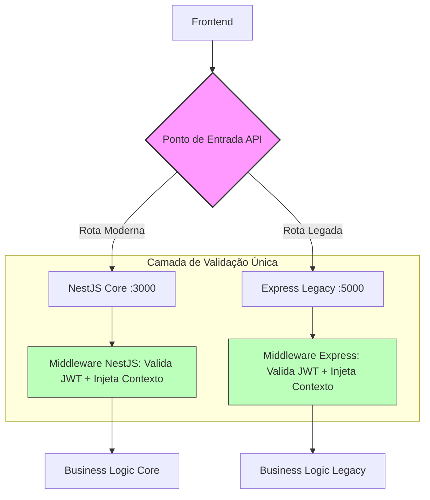

# Materialização: Blueprint de Interoperabilidade de Core

---

## 📖 Narrativa de Valor (O "Por Quê")
O objetivo deste blueprint é acabar com o "vácuo" entre o sistema antigo (Express) e o novo (NestJS). Sem esta ponte, o sistema parece quebrado para o usuário. Com ela, garantimos uma experiência de **Plataforma Única**, onde a segurança e o contexto do cliente são preservados em 100% das telas.

### 🚀 O que este desenho resolve?
- **Login Único:** O usuário loga uma vez no Core e é reconhecido em todo o ecossistema.
- **Blindagem de Dados:** O `tenantId` é validado em todas as rotas, impedindo vazamentos entre clientes.
- **Escalabilidade:** Permite que novas funcionalidades sejam criadas no NestJS enquanto o legado continua rodando sem interrupção.

---

## 📐 Fluxo de Roteamento (A Visão de Voo)
*Foco: Como o sistema decide quem responde a cada requisição.*



---

## ⛓️ Orquestração de Segurança (A Visão de Engrenagem)
*Foco: O aperto de mão técnico entre os backends.*

```mermaid
sequenceDiagram
    participant F as Frontend
    participant N as NestJS Core (Issuer)
    participant E as Express Legacy (Consumer)
    participant DB as Banco de Dados Prisma

    F->>N: POST /auth/login
    N->>DB: Valida Credenciais
    DB-->>N: Usuário OK + Tenant Context
    N-->>F: Retorna JWT (com tenantId no payload)

    Note over F, E: Acesso a Rota Legada
    F->>E: GET /api/v1/legacy-data
    Auth: Bearer <JWT>
    
    E->>E: Middleware: Valida Assinatura (Shared Secret)
    E->>E: Extrai tenantId do Payload
    E->>DB: Query: WHERE tenant_id = x
    DB-->>E: Dados Isolados
    E-->>F: JSON Response
```

---

## 🛡️ Auditoria do Projetista
- **Status de Design:** ✅ COMPLETO
- **Documento Mestre:** `beehive/construcao/blueprints/BLUEPRINT_INTEROP_CORE.md`

> "O design foca na simplicidade. Usamos o JWT como a única fonte de verdade para evitar que o Express precise fazer consultas extras de autenticação."

---
*Materialização gerada sob diretriz DIR-070.*
