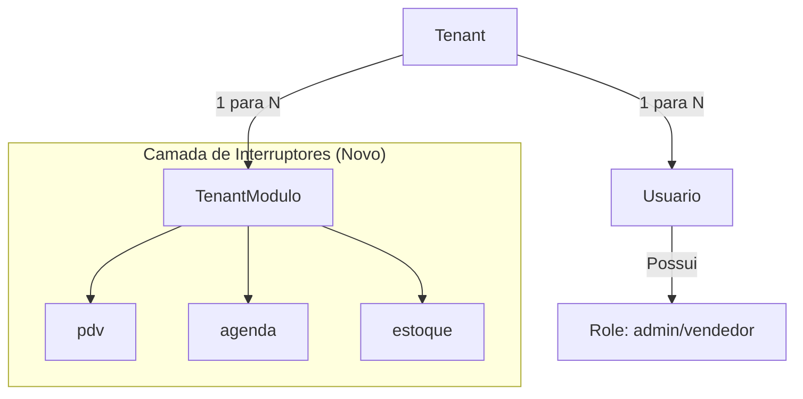
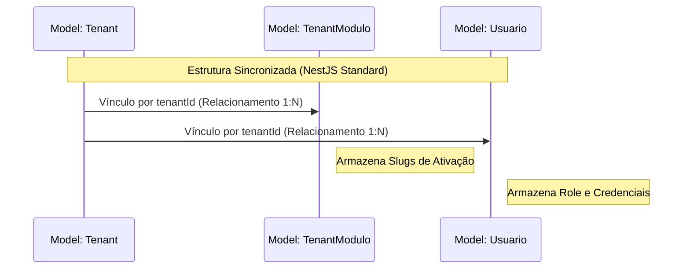

# Materialização: CORE-003 — Sincronia de Schema (Cérebro Modular)

---

## 📖 Narrativa de Valor (O "Por Quê")
Esta entrega solda a base de dados para o novo mundo modular do TenantOS. Renomeamos campos para o padrão moderno (NestJS) e criamos a tabela de **Interruptores de Módulos**. Sem esta alteração, o sistema não teria "memória" para saber quais funcionalidades cada cliente comprou.

### 🚀 O que mudou no "Hardware" (Banco de Dados)?
- **Normalização NestJS:** `tenant_id` agora é `tenantId` e `tipo` agora é `role`. Fim da confusão de nomes.
- **Tabela de Módulos:** Criada a `TenantModulo`, a peça central do sistema **Plug & Play**.
- **Segurança de Role:** O sistema agora garante que todo novo usuário nasça como `vendedor` por padrão, evitando acessos admin acidentais.

---

## 📐 Fluxo de Dados (A Visão de Voo)
*Foco: Como o Banco agora suporta a modularidade.*

---

## ⛓️ Orquestração de Relacionamento (A Visão de Engrenagem)
*Foco: O vínculo técnico entre as novas tabelas.*

---

## 🛡️ Auditoria do Tech Lead
- **Status Técnico:** ✅ EXECUTADO PELO COPILOT
- **Validação:** `npx prisma generate` executado com sucesso.
- **Risco de Dados:** Baixo. Foi um Rename e uma Adição. Dados existentes foram preservados.

---
*Materialização gerada sob diretriz DIR-070.*
