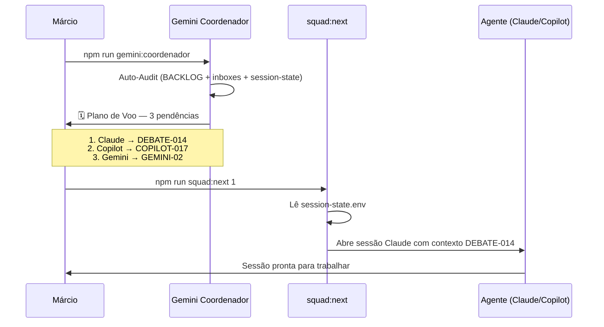

# Materialização — DEBATE-013: O Maestro Aumentado
**Data:** 2026-05-26
**Decisão:** Opção A + B aprovada pelo Márcio
**Debate de origem:** `beehive/construcao/debates/DEBATE-013-ORQUESTRADOR.md`

---

## Narrativa

O squad do Hive tinha papéis bem definidos, mas nenhum agente agia sozinho. Toda sessão exigia que Márcio fosse o maestro na prática: abrir terminal, colar contexto, definir prioridade, decidir quem age. O framework estava funcionando — mas a orquestração era manual disfarçada de processo.

O DEBATE-013 foi aberto para resolver isso. Após análise de quatro opções (Gemini como maestro, script determinístico, daemon autônomo e status quo intencional), Claude e Gemini convergiram na mesma direção: **O Maestro Aumentado** — combinação das Opções A e B.

A decisão não foi construir algo novo do zero. Foi dar ao Gemini Coordenador — que já existia como cartucho — um **ritual obrigatório de abertura** com formato padronizado, e dar ao Márcio um único comando (`squad:next`) que elimina o trabalho de montar contexto e abrir sessões manualmente.

---

## O que mudou

### Antes
```
Márcio acorda, quer trabalhar
  ↓ abre terminal
  ↓ roda npm run squad:session:claude
  ↓ cola o contexto manualmente
  ↓ lê inboxes na cabeça
  ↓ decide prioridade
  ↓ decide quem age
  ↓ abre sessão do agente
[começa o trabalho]
```

### Depois
```
Márcio acorda, quer trabalhar
  ↓ npm run gemini:coordenador
  ↓ Gemini lê tudo (backlog + inboxes + estado)
  ↓ Plano de Voo pronto:
      "1. Claude → DEBATE-014  2. Copilot → COPILOT-017  3. ..."
  ↓ Márcio: "1"
  ↓ npm run squad:next 1
[sessão do Claude abre com contexto do DEBATE-014]
```

---

## Diagrama do Fluxo



---

## Artefatos produzidos

| Artefato | Tipo | Localização |
|---|---|---|
| Ritual de abertura do Coordenador | Atualização de role | `beehive/roles/coordenador.md` |
| Consolidação do DEBATE-013 | Decisão arquitetural | `beehive/construcao/debates/DEBATE-013-ORQUESTRADOR.md` |
| Script `squad:next` | Handoff Copilot (COPILOT-019) | `beehive/construcao/inbox-copilot.md` |
| Este documento | Materialização | `beehive/docs/materializacao/DEBATE-013-ORQUESTRADOR/` |

---

## Decisões de design

**Por que não o daemon (Opção C)?**
WSL não mantém processos background de forma confiável. Complexidade de infraestrutura sem ROI claro neste estágio. O ganho de "autonomia total" não compensa o custo de manutenção.

**Por que não o status quo (Opção D)?**
Márcio sinalizou explicitamente que quer menos carga operacional. Manter o maestro manual seria ignorar o feedback do Owner.

**Por que o Gemini e não o Claude como orquestrador?**
O cartucho `coordenador` já existia no Gemini com essa missão definida. Claude é Arquiteto + Auditor — seu papel é especificar e revisar, não coordenar o fluxo diário. Separação de responsabilidades preservada.

**Por que o formato numerado do Plano de Voo?**
Permite integração direta com `squad:next <N>`. O número do plano vira o argumento do comando. Zero ambiguidade, zero digitação extra.

---

## Limite reconhecido

O Gemini ainda precisa ser iniciado manualmente pelo Márcio (`npm run gemini:coordenador`). O sistema não acorda sozinho — o trigger inicial ainda é humano. Isso é **intencional neste estágio**: nenhum agente age sem intenção explícita do Owner.

A autonomia completa (agente acorda, lê estado, notifica Márcio) é um possível passo futuro — mas exige infraestrutura de background process estável, que está fora do escopo atual.
