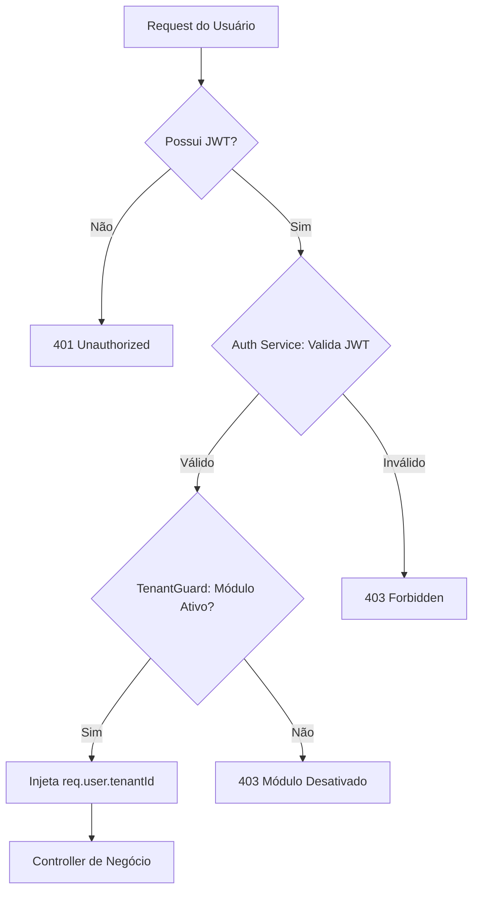
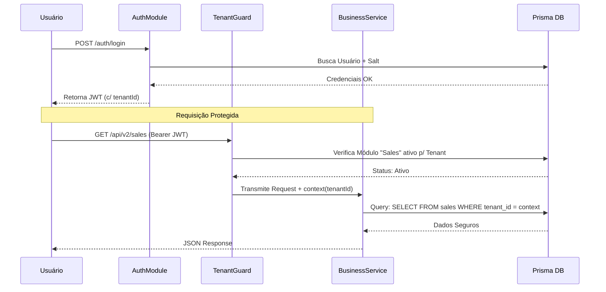

# Materialização: Lote 1 — Fundação & Cérebro Modular

---

## 📖 Narrativa de Valor (O "Por Quê")
O Lote 1 é a reconstrução do "Cérebro" do TenantOS. Até agora, o sistema não tinha um segurança na porta (Auth) nem sabia separar quem é quem (TenantContext). Este lote instala o motor de segurança JWT e prepara a arquitetura para ser **Plug & Play**, permitindo que o Márcio ligue e desligue funcionalidades do cliente com um clique no banco de dados.

### 🚀 O que este lote entrega?
- **Paz de Espírito:** Blindagem contra vazamento de dados entre clientes.
- **Modelo de SaaS Industrial:** O sistema passa a entender "Capacidades" (Módulos).
- **Pronto para a Escala:** Sem este lote, o sistema seria apenas um brinquedo técnico; com ele, torna-se uma plataforma comercializável.

---

## 📐 Fluxo de Segurança (A Visão de Voo)
*Foco: Como o TenantGuard protege a fábrica.*

---

## ⛓️ Orquestração de Login & Contexto (A Visão de Engrenagem)
*Foco: A vida de um token do NestJS até o Service.*

---

## 🛡️ Auditoria do Tech Lead
- **Status de Engenharia:** ✅ WORK ORDERS PRONTAS
- **Lote:** FOUNDATION (CORE-001 até 004)

> "A fundação agora contempla a visão de negócio Modular. O Copilot tem um contrato fechado para soldar a segurança do sistema."

---
*Materialização gerada sob diretriz DIR-070.*
