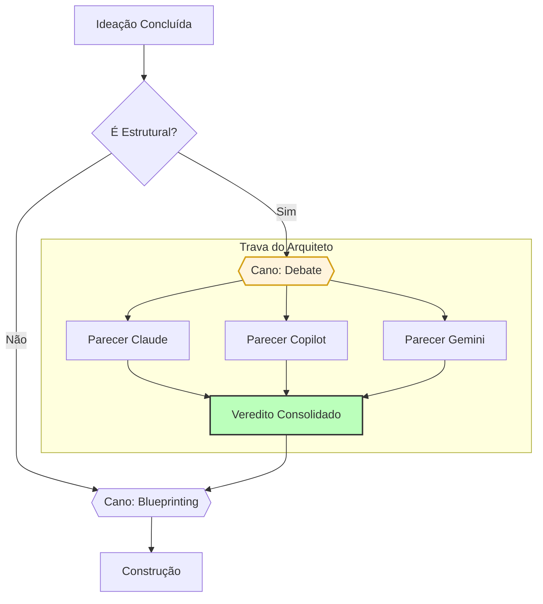
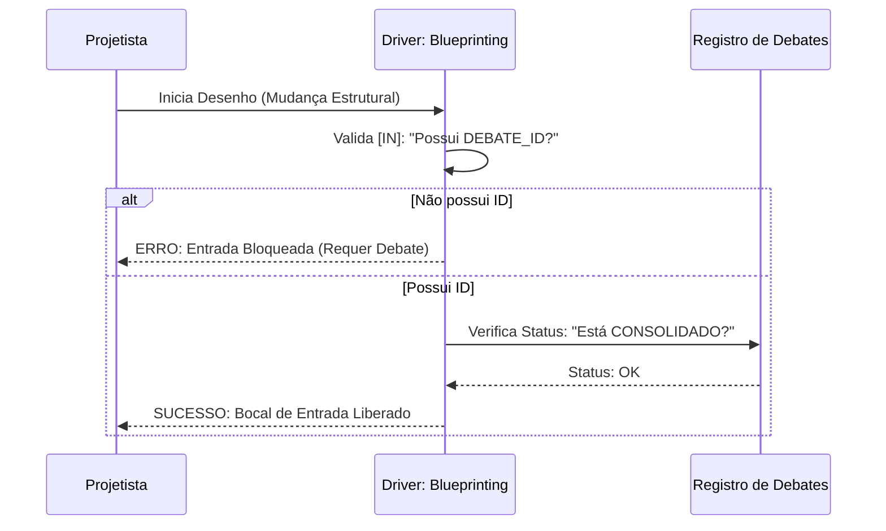

# Materialização: Correção de Governança (The Debate Gate)

---

## 📖 Narrativa de Valor (O "Por Quê")
Identificamos um "vão" na fábrica: o sistema permitia que mudanças críticas na fundação do software (como Autenticação e Banco de Dados) fossem desenhadas sem o olhar do Arquiteto. Esta correção institui o **Cano de Debate** como uma trava obrigatória. Agora, nenhuma decisão de "fundação" é tomada no escuro, garantindo que o TenantOS seja seguro e escalável por design, não por sorte.

### 🚀 O que esta correção resolve?
- **Fim da Decisão Solitária:** Impede que o Tech Lead feche contratos de arquitetura sem o Arquiteto.
- **Isenção Técnica:** Obriga o uso do método socrático e o registro de alternativas descartadas.
- **Rastreabilidade de Decisão:** Cada blueprint estrutural agora tem um "Certificado de Consenso" (o ID do Debate).

---

## 📐 Fluxo de Governança Atualizado (A Visão de Voo)
*Foco: A nova bifurcação de segurança.*

---

## ⛓️ Orquestração de Bloqueio (A Visão de Engrenagem)
*Foco: Como o Blueprinting rejeita entradas sem debate.*

---

## 🛡️ Auditoria do Tech Lead
- **Status Técnico:** ✅ BLINDADO
- **Arquivos Afetados:** `HIVE_PROCESS_TOPOLOGY.md`, `blueprinting/DRIVER.md`, `debate/DRIVER.md`.

> "O erro de hoje foi a última chance do sistema falhar por excesso de autonomia. A trava agora é programática."

---
*Materialização gerada sob diretriz DIR-070.*
