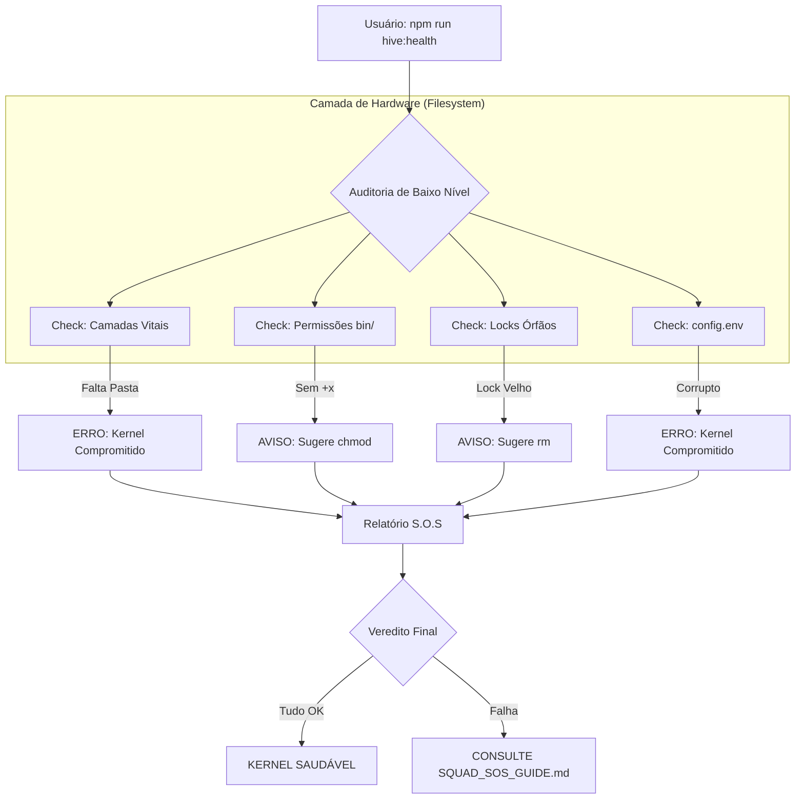
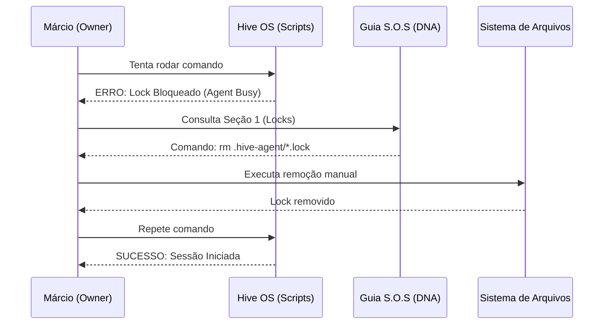

# Materialização: Camada de Soberania do Owner (S.O.S)

---

## 📖 Narrativa de Valor (O "Por Quê")
A soberania resolve o problema da "Caixa Preta". Até agora, se o Hive travasse ou uma IA alucinasse, o Owner ficava refém do sistema. Esta camada entrega as "Chaves do Hardware" para o Márcio, permitindo diagnósticos profundos e intervenções manuais seguras.

### 🚀 O que ela entrega (O Resultado)?
- **Transparência Total:** O Owner sabe exatamente onde cada engrenagem do Hive está.
- **Poder de Resgate:** Capacidade de destravar o sistema (locks) e resetar memórias sem depender da IA.
- **Portabilidade Provada:** Um caminho claro para mover o "Cérebro" para novos projetos.

---

## 📐 Fluxo de Diagnóstico (A Visão de Voo)
*Foco: Como o comando hive:health protege o sistema.*

---

## ⛓️ Orquestração de Resgate (A Visão de Engrenagem)
*Foco: Como o Owner usa o Guia S.O.S para destravar a fábrica.*

---

## 🛡️ Auditoria do Tech Lead
- **Status Técnico:** ✅ IMPLEMENTADO
- **Ferramenta:** `beehive/bin/hive-health.sh`
- **Manual:** `beehive/dna/SQUAD_SOS_GUIDE.md`

> "O Owner agora é o mecânico chefe. O Hive deixou de ser uma caixa preta para se tornar um ativo mantível e resiliente."

---
*Materialização gerada sob diretriz DIR-070.*
