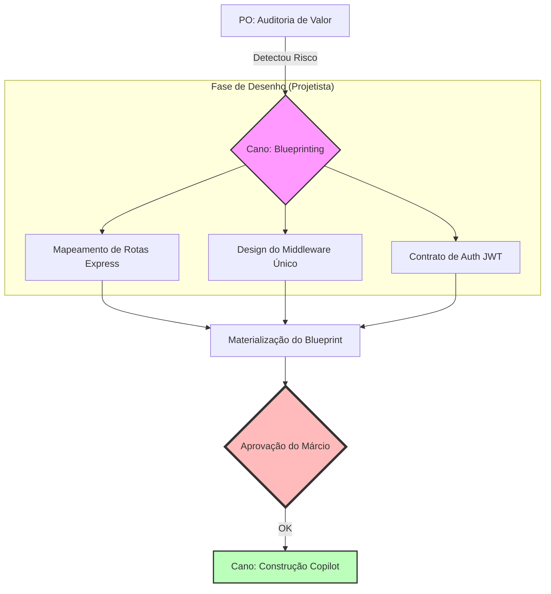
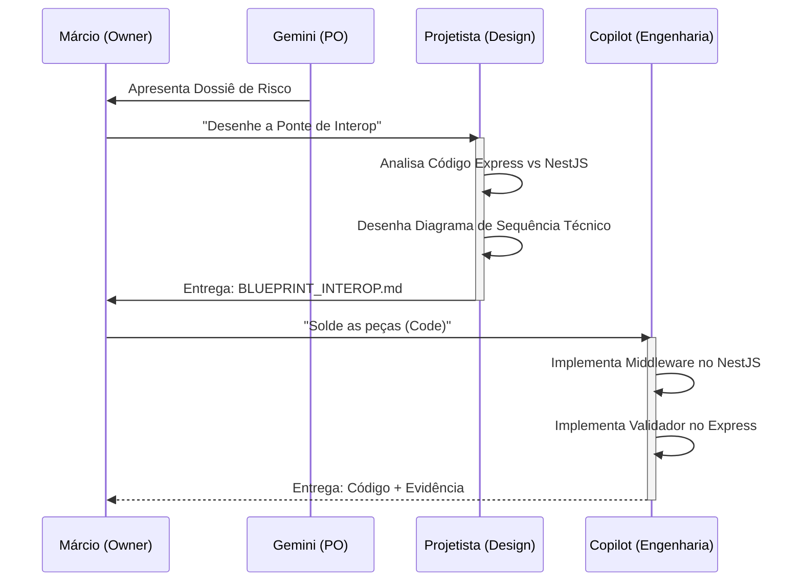

# Mapa de Inicialização: Saneamento de Core & Interoperabilidade

Este documento descreve o fluxo estratégico que seguiremos para resolver a bifurcação de backends (NestJS vs Express), garantindo que o TenantOS tenha um núcleo sólido para os Blueprints de venda.

---

## 📖 Narrativa Estratégica (O "Por Quê")
Hoje o sistema está dividido em dois "cérebros" que não se falam bem. O objetivo desta frente de trabalho é construir uma **Ponte de Contexto**. 
Queremos que o Frontend peça dados e não precise saber se quem responde é o NestJS ou o Express. O usuário deve ter uma sessão única, segura e invisível.

### 🚀 Metas da Inicialização:
1.  **Unificar Autenticação:** Uma única chave (JWT) para ambos os sistemas.
2.  **Padronizar o Tenant:** Garantir que o `tenant_id` seja detectado de forma idêntica em todas as rotas.
3.  **Eliminar o Frankenstein:** Preparar o terreno para a migração total para NestJS sem quebrar a operação atual.

---

## 📐 Fluxo de Trabalho (A Visão de Voo)
*Foco: Os estágios de maturidade da solução.*

---

## ⛓️ Orquestração de Agentes (A Visão de Engrenagem)
*Foco: Como os papéis do Hive vão interagir para resolver o problema.*

---

## 🛡️ Próximos Passos Imediatos
1.  **Ativação do Projetista:** Ele iniciará a leitura de `apps/core` e `apps/backend`.
2.  **Mapeamento de Pontos de Conflito:** Identificar onde o Auth falha hoje.
3.  **Entrega do Desenho Técnico:** Você receberá o contrato da "Ponte".

---
*Documento de Inicialização sob padrão Hive OS.*
