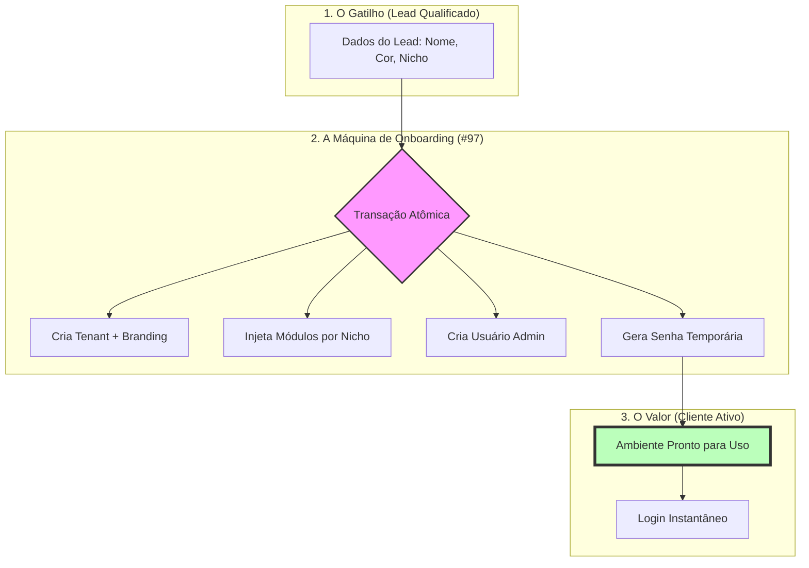
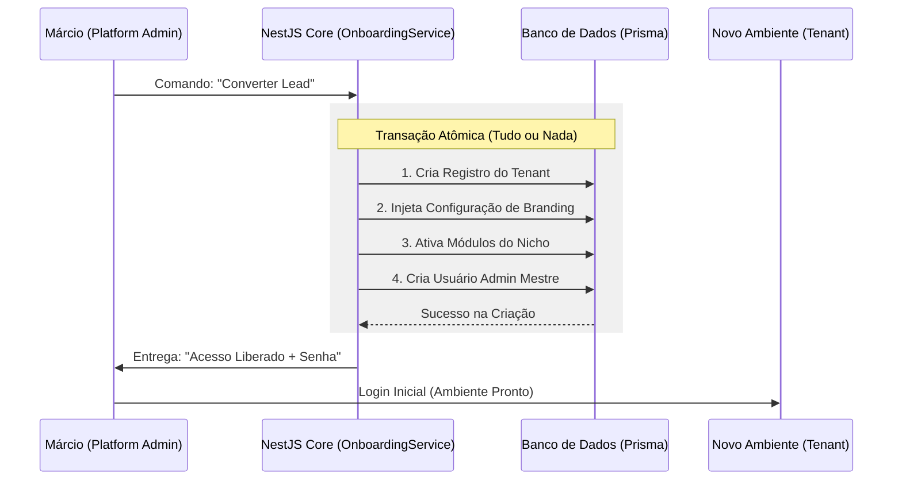

# Materialização: Issue #97 — Onboarding Full

---

## 📖 Narrativa de Valor (O "Por Quê")
Imagine que você acabou de convencer um dono de PetShop ou de um Restaurante a usar o seu sistema. Hoje, a conversão é "magra": cria-se um registro, mas o sistema está vazio, sem cor, sem módulos e sem usuário.

A **Issue #97** é a inteligência que faz o **"Setup Mágico"**. Ela transforma o Lead em um Tenant (Cliente) 100% operacional em um único clique.

### 🚀 O que ela entrega (O Resultado)?
- **Ambiente Brandado:** O sistema assume a cor e a logo do cliente automaticamente.
- **Módulos Inteligentes:** Injeção automática de ferramentas baseada no nicho (Varejo vs Serviços).
- **Usuário Admin Pronto:** Criação imediata do acesso mestre com senha temporária.

---

## 📐 Fluxo de Processo (A Visão de Voo)
*Foco: O caminho do dado e as etapas de decisão.*

---

## ⛓️ Orquestração Técnica (A Visão de Engrenagem)
*Foco: Interação entre componentes e atomicidade da transação.*

---

## 🛡️ Auditoria do Tech Lead
- **Status Técnico:** ✅ VALIDADO
- **Evidência Relacionada:** `beehive/docs/evidencias/2026-05-26-issue-97-audit.md`

> "O Onboarding Full resolve o maior gargalo de conversão do TenantOS, garantindo que o cliente sinta o valor do produto no segundo zero."

---
*Materialização gerada sob diretriz DIR-070.*
