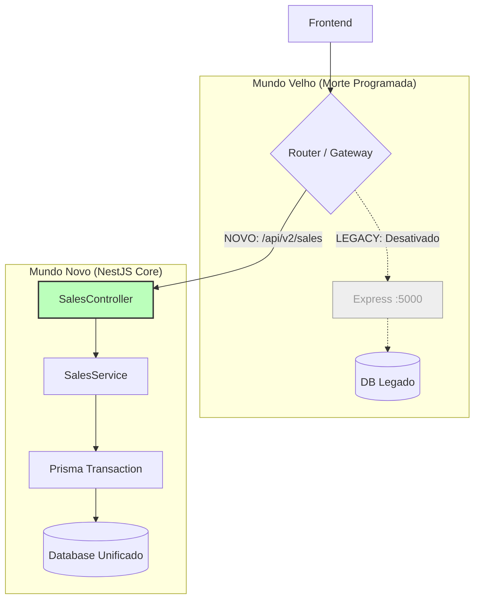
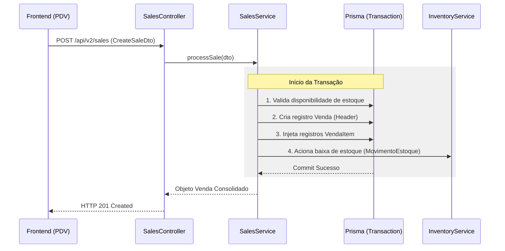

# Materialização: Morte do Legado (Módulo de Vendas)

---

## 📖 Narrativa de Valor (O "Por Quê")
O Módulo de Vendas é o motor financeiro do TenantOS. Mantê-lo no Express legado é como correr uma maratona com uma bola de ferro no pé. Esta reescrita para NestJS Core elimina o débito técnico, garante que nenhum dado de venda seja perdido por falhas de tipo e prepara o sistema para escalar.

### 🚀 O que este desenho entrega?
- **Segurança Atômica:** Uso de Prisma Transactions para garantir que a venda só exista se o estoque for baixado.
- **Desenvolvimento Acelerado:** Uma API limpa e tipada para que novas funções (como cupom de desconto) sejam criadas em horas, não dias.
- **Unificação de Cérebro:** O Frontend passa a falar com um único backend, reduzindo erros de conexão e latência.

---

## 📐 Fluxo de Transição (A Visão de Voo)
*Foco: Como o legado morre e o novo nasce.*

---

## ⛓️ Orquestração de Engenharia (A Visão de Engrenagem)
*Foco: A precisão da transação no NestJS.*

---

## 🛡️ Auditoria do Projetista
- **Status de Design:** ✅ PRONTO PARA OBRA
- **Contrato de Saída:** `beehive/construcao/blueprints/BLUEPRINT_LEGACY_DEATH_SALES.md`

> "Este desenho é o primeiro prego no caixão do Express. Focamos em atomicidade total para dar confiança ao Owner no fechamento de caixa."

---
*Materialização gerada sob diretriz DIR-070.*
